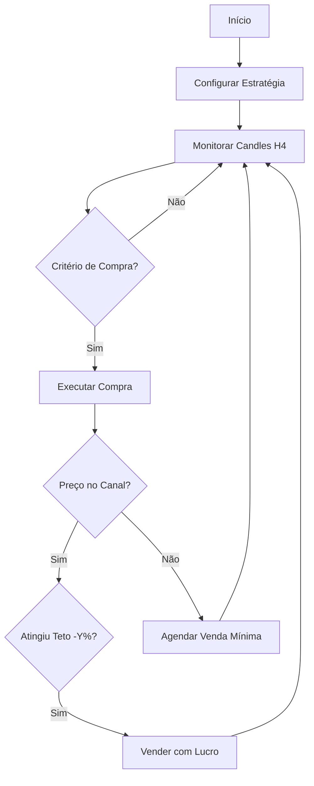
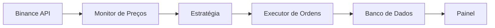

# 🔄 Fluxo Operacional  
`/Documentação Técnica/03 Estratégia/Fluxo Operacional.md`  

## 1. Diagrama do Fluxo Principal  


## 2. Passo a Passo Executável  
### **Fase 1: Configuração**  
1. Definir parâmetros na tabela `strategies`:  
   ```sql
   INSERT INTO strategies 
   (base_price, top_price, buy_threshold, sell_threshold, min_profit)
   VALUES (100489.00, 110626.00, 1.5, 1.8, 0.5);
   ```

### **Fase 2: Operação em Tempo Real**  
- **Código Python Simplificado**:  
  ```python
  while True:
      preco = obter_preco_atual()
      canal = calcular_canal()  # Base/Teto dos últimos 50 candles
      
      if deve_comprar(preco, canal):
          executar_compra()
      
      for posicao in posicoes_abertas():
          if deve_vender(posicao, preco, canal):
              executar_venda(posicao)
          elif fora_do_canal(posicao, canal):
              agendar_venda_segura(posicao)
  ```

## 3. Fluxos de Exceção  
| Cenário                | Ação                          | Gatilho                  |
|------------------------|-------------------------------|--------------------------|
| **API Binance Offline** | Pausar operações e notificar | `BinanceAPIException`    |
| **Volatilidade Extrema** | Ignorar sinal                | `spread > 2% do canal`   |
| **Falta de Liquidez**   | Cancelar ordem após 5min      | `order_status = OPEN`    |

## 4. Exemplo Prático  
**Dados**:  
- Base: 100,489 USDT | Teto: 110,626 USDT  
- Compra: +1.5% (102,000 USDT)  
- Venda Normal: -1.8% do teto (108,634 USDT)  
- Venda Emergencial: 101,000 USDT (fora do canal)  

**Sequência**:  
1. Sistema detecta preço em 102,000 → Compra  
2. Preço cai para 99,000 (fora do canal) → Agenda venda em 101,000  
3. Preço sobe para 101,500 → Não vende (abaixo do mínimo)  
4. Preço atinge 101,100 → Executa venda  

## 5. Integração com Componentes  


## 6. Próximos Passos  
1. [Implementar executor de ordens](../04%20Desenvolvimento%20Técnico/API%20Reference.md)  
2. [Configurar alertas](../05%20Gestão%20de%20Risco/Failover%20Strategies.md)  

--- 

### 💡 Dicas para Implementação:  
- Use **`apscheduler`** para o agendamento de vendas  
- Armazene **todos os eventos** na tabela `trades` para auditoria  
- Teste o fluxo com **dados históricos** antes de operar ao vivo  
