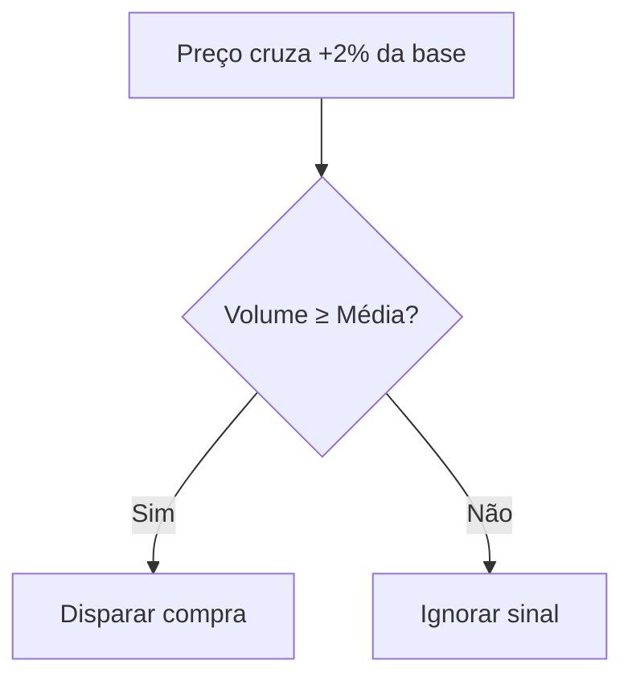
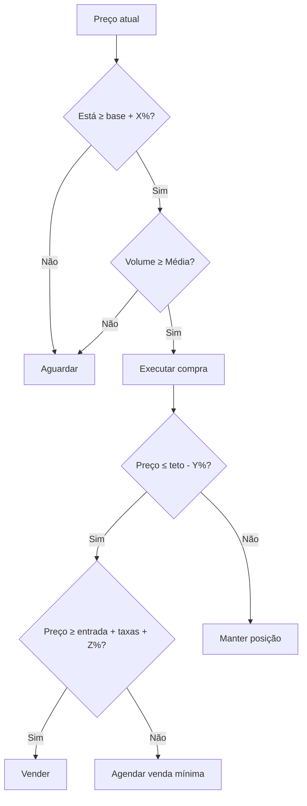

# 📊 Regras do Canal de Preços

`/Documentação Técnica/03 Estratégia/Regras do Canal de Preços.md`

## 1. Definição do Canal

Parâmetros essenciais para identificação do canal:

|Parâmetro|Tipo|Exemplo BTC/USDT|Fórmula|
|---|---|---|---|
|**Base (Suporte)**|`Decimal`|100,489.00|Mínima dos últimos 50 candles H4|
|**Teto (Resistência)**|`Decimal`|110,626.00|Máxima dos últimos 50 candles H4|
|**Largura Mínima**|`Percentual`|5%|`(Teto - Base) / Base ≥ 5%`|

```python
# Pseudocódigo: Identificação do Canal
def calcular_canal(symbol):
    candles = binance.get_klines(symbol, "4h", limit=50)
    base = min(candle["low"] for candle in candles)
    teto = max(candle["high"] for candle in candles)
    return (base, teto) if (teto - base)/base >= 0.05 else None
```

## 2. Regras de Entrada (Compra)

### Critérios Obrigatórios:

✅ **Valorização a partir da base**:

- `preço_atual ≥ base * (1 + X%)`
- Onde `X` é configurável (padrão: 1-2%)

✅ **Volume compatível**:

- Volume das últimas 4 velas ≥ Média 20 períodos



## 3. Regras de Saída (Venda)

### Cenários:

|Situação|Ação|Fórmula|
|---|---|---|
|**Normal (dentro do canal)**|Venda no -2% do teto|`preço_atual ≤ teto * 0.98`|
|**Rompimento de canal**|Agendar venda com lucro mínimo|`preço_venda ≥ entrada + taxas + 0.5%`|
|**Emergencial**|Não vender com prejuízo|Bloqueio via código|

## 4. Exemplo Prático

**Dados**:

- Base: 100,489 USDT
- Teto: 110,626 USDT
- Config: +1.5% compra / -1.8% venda

**Fluxo**:

1. Compra acionada em: `100,489 * 1.015 = 101,996.33 USDT`
2. Venda programada em: `110,626 * 0.982 = 108,634.73 USDT`
3. Se sair do canal em 105,000:
    - Venda só executará acima de `101,996.33 * 1.005 = 102,506.31 USDT`

## 5. Validação do Canal

### Testes Automatizados:

```python
import pytest

def test_canal_valido():
    base, teto = 100489.00, 110626.00
    assert (teto - base)/base >= 0.05  # Largura mínima 5%

def test_entrada_compra():
    preço = 101996.33
    base = 100489.00
    assert preço >= base * 1.015
```
## 6. Parâmetros Configuráveis

Via endpoint `PATCH /strategies/{id}`:

```json
{
    "buy_threshold": 1.5,
    "sell_threshold": 1.8,
    "min_profit": 0.5,
    "width_alert": 3.0  # Alerta se canal < 3%
}
```

## 7. Fluxograma de Decisão



**Legenda**:

- **X%**: Threshold de compra (ex: 1-2%)
- **Y%**: Threshold de venda (ex: 1-2%)
- **Z%**: Lucro mínimo (ex: 0.5%)

### Versão Textual Simplificada:

1. **Compra**:
    - Se preço ≥ (base + X%) **E** volume ≥ média → Comprar
    - Senão → Aguardar
2. **Venda**:
    - Se preço ≤ (teto - Y%) **E** preço ≥ (entrada + taxas + Z%) → Vender
    - Se sair do canal → Agendar venda no mínimo (entrada + taxas + Z%)

### Código para Implementação:

```python

def decidir_acao(preco_atual, base, teto, entrada, taxa):
    # Parâmetros configuráveis
    X = 1.5  # % para compra
    Y = 1.8  # % para venda
    Z = 0.5  # % lucro mínimo
    
    if preco_atual >= base * (1 + X/100):
        if volume >= media_volume:
            return "COMPRAR"
    
    if preco_atual <= teto * (1 - Y/100):
        if preco_atual >= entrada * (1 + (Z + taxa)/100):
            return "VENDER"
        else:
            return f"AGENDAR VENDA EM {entrada * (1 + (Z + taxa)/100):.2f}"
    
    return "AGUARDAR"
```