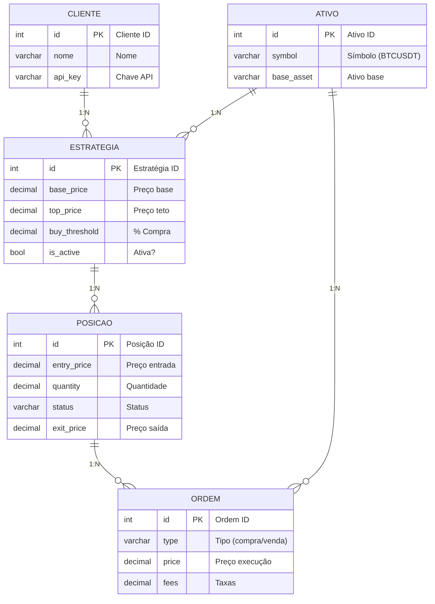

# 🗃️ Modelagem de Dados  
`/Documentação Técnica/04 Desenvolvimento Técnico/Modelagem de Dados.md`  

## 1. Diagrama Entidade-Relacionamento (DER)  



---

## 2. Script SQL de Criação  
```sql
CREATE TABLE clients (
    id SERIAL PRIMARY KEY,
    name VARCHAR(100) NOT NULL,
    api_key VARCHAR(100) UNIQUE NOT NULL,
    created_at TIMESTAMP DEFAULT CURRENT_TIMESTAMP
);

CREATE TABLE symbols (
    id SERIAL PRIMARY KEY,
    symbol VARCHAR(20) UNIQUE NOT NULL,
    base_asset VARCHAR(10) NOT NULL,
    quote_asset VARCHAR(10) NOT NULL
);

CREATE TABLE strategies (
    id SERIAL PRIMARY KEY,
    client_id INTEGER NOT NULL REFERENCES clients(id) ON DELETE CASCADE,
    symbol_id INTEGER NOT NULL REFERENCES symbols(id) ON DELETE CASCADE,
    base_price DECIMAL(18, 8) NOT NULL,
    top_price DECIMAL(18, 8) NOT NULL,
    buy_threshold DECIMAL(5, 2) NOT NULL CHECK (buy_threshold BETWEEN 0.1 AND 5),
    sell_threshold DECIMAL(5, 2) NOT NULL CHECK (sell_threshold BETWEEN 0.1 AND 5),
    capital_percentage DECIMAL(5, 2) NOT NULL CHECK (capital_percentage BETWEEN 1 AND 100),
    is_active BOOLEAN DEFAULT TRUE,
    created_at TIMESTAMP DEFAULT CURRENT_TIMESTAMP
);

CREATE TABLE positions (
    id SERIAL PRIMARY KEY,
    strategy_id INTEGER NOT NULL REFERENCES strategies(id) ON DELETE CASCADE,
    symbol_id INTEGER NOT NULL REFERENCES symbols(id) ON DELETE CASCADE,
    entry_price DECIMAL(18, 8) NOT NULL,
    quantity DECIMAL(18, 8) NOT NULL,
    fees DECIMAL(18, 8) DEFAULT 0,
    status VARCHAR(20) NOT NULL CHECK (status IN ('open', 'scheduled', 'closed')),
    exit_price DECIMAL(18, 8),
    scheduled_exit_price DECIMAL(18, 8),
    channel_exit_date TIMESTAMP,
    created_at TIMESTAMP DEFAULT CURRENT_TIMESTAMP
);

CREATE TABLE trades (
    id SERIAL PRIMARY KEY,
    position_id INTEGER REFERENCES positions(id) ON DELETE SET NULL,
    client_id INTEGER NOT NULL REFERENCES clients(id) ON DELETE CASCADE,
    symbol_id INTEGER NOT NULL REFERENCES symbols(id) ON DELETE CASCADE,
    type VARCHAR(10) NOT NULL CHECK (type IN ('buy', 'sell')),
    price DECIMAL(18, 8) NOT NULL,
    quantity DECIMAL(18, 8) NOT NULL,
    fees DECIMAL(18, 8) DEFAULT 0,
    profit DECIMAL(18, 8),
    notes TEXT,
    executed_at TIMESTAMP DEFAULT CURRENT_TIMESTAMP
);
```

---

## 3. Relacionamentos Chave  
| Tabela       | Relacionamento         | Cardinalidade | Observações                     |
|--------------|------------------------|---------------|---------------------------------|
| `strategies` → `positions` | 1:N           | Cada estratégia pode ter múltiplas posições |
| `positions` → `trades`    | 1:N           | Registro completo de todas as operações |
| `symbols` → `strategies`  | 1:N           | Um símbolo pode ser usado em várias estratégias |

---

## 4. Índices Recomendados  
```sql
-- Melhora consultas de status de posições
CREATE INDEX idx_positions_status ON positions(status);

-- Acelera consultas históricas
CREATE INDEX idx_trades_symbol_executed ON trades(symbol_id, executed_at);

-- Otimiza joins frequentes
CREATE INDEX idx_strategies_client ON strategies(client_id);
```

---

## 5. Exemplo de Consultas Úteis  

### 5.1 Posições Abertas por Estratégia  
```sql
SELECT 
    s.id AS strategy_id,
    COUNT(p.id) AS open_positions
FROM strategies s
LEFT JOIN positions p ON p.strategy_id = s.id AND p.status = 'open'
GROUP BY s.id;
```

### 5.2 Lucro por Par de Moedas  
```sql
SELECT 
    sym.symbol,
    SUM(t.profit) AS total_profit
FROM trades t
JOIN symbols sym ON t.symbol_id = sym.id
GROUP BY sym.symbol;
```

---

## 6. Migrações com Alembic  
Exemplo de arquivo de migração (`migrations/versions/001_initial.py`):  
```python
def upgrade():
    op.create_table(
        'strategies',
        Column('id', Integer, primary_key=True),
        Column('client_id', Integer, ForeignKey('clients.id')),
        Column('base_price', Numeric(18, 8)),
        Column('top_price', Numeric(18, 8))
    )

def downgrade():
    op.drop_table('strategies')
```

---

## 7. Próximos Passos  
1. [Implementar repositórios](../04%20Desenvolvimento%20Técnico/API%20Reference.md)  
2. [Configurar backups automáticos](../05%20Gestão%20de%20Risco/Failover%20Strategies.md)  

---

### ✅ Checklist de Implementação  
- [ ] Criar todas as tabelas no banco de produção  
- [ ] Popular tabela `symbols` com ativos iniciais (BTCUSDT, ETHUSDT)  
- [ ] Configurar conexão segura com SSL  
