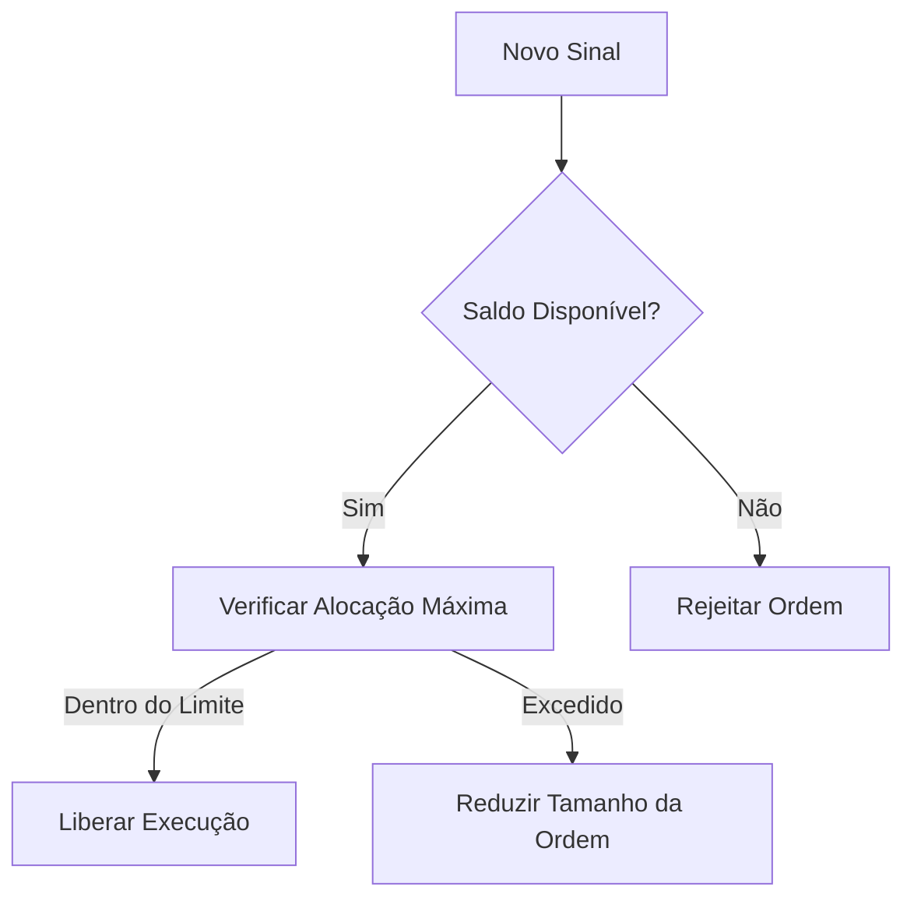

# 🛡️ Controle de Capital  
`/Documentação Técnica/05 Gestão de Risco/Controle de Capital.md`  

## 1. Regras Fundamentais  

### 1.1. Alocação por Operação  
```python
def calcular_alocacao(saldo_total: float, estrategia_id: int) -> float:
    estrategia = db.query("SELECT capital_percentage FROM strategies WHERE id = ?", estrategia_id)
    return saldo_total * (estrategia.capital_percentage / 100)
```

| Parâmetro         | Valor Padrão  | Ajuste Máximo |
| ----------------- | ------------- | ------------- |
| Capital por Trade | 20%           | 5% a 30%      |
| Stop Loss         | Não utilizado | -             |

### 1.2. Segregação de Lucros  
```sql
-- Tabela de controle
CREATE TABLE capital_allocations (
    id SERIAL PRIMARY KEY,
    client_id INTEGER REFERENCES clients(id),
    strategy_id INTEGER REFERENCES strategies(id),
    amount DECIMAL(18, 8) NOT NULL,
    is_profit BOOLEAN DEFAULT FALSE  -- FALSE = Capital principal, TRUE = Lucros
);
```

## 2. Fluxo de Bloqueio  


## 3. Monitoramento em Tempo Real  

### 3.1. Query de Exposição Atual  
```sql
SELECT 
    s.name AS estrategia,
    SUM(p.quantity * p.entry_price) AS capital_em_risco,
    (SUM(p.quantity * p.entry_price) / c.balance * 100 AS percentual_exposicao
FROM positions p
JOIN strategies s ON p.strategy_id = s.id
JOIN clients c ON s.client_id = c.id
WHERE p.status = 'open'
GROUP BY s.name, c.balance;
```

### 3.2. Alertas Automáticos  
| Condição                   | Ação                              |
| -------------------------- | --------------------------------- |
| Exposição > 25% do capital | Notificar + Bloquear novas ordens |
| Lucros acumulados > 50%    | Sugerir retirada parcial          |

## 4. Exemplo Prático  

**Dados**:  
- Saldo Total: 10,000 USDT  
- Estratégia "Canal H4" (20% alocado)  

**Operação**:  
1. Capital Disponível: `10,000 * 0.2 = 2,000 USDT`  
2. Se posição aberta de 1,500 USDT:  
   - Saldo Restante: `2,000 - 1,500 = 500 USDT`  
3. Nova ordem de 600 USDT seria:  
   - **Ajustada para 500 USDT** automaticamente  

## 5. Políticas de Emergência  

### 5.1. Reset Diário  
```python
async def reset_daily_allocation():
    await db.execute(
        "UPDATE capital_allocations SET amount = 0 "
        "WHERE is_profit = FALSE AND created_at < NOW() - INTERVAL '1 day'"
    )
```

### 5.2. Failsafe  
- **Desligamento Automático**: Se perda acumulada > 15% do capital em 24h  

## 6. Integração com o Sistema  

```python
@app.post("/orders")
async def create_order(order: OrderRequest):
    capital = get_available_capital(order.client_id)
    if order.quantity * order.price > capital:
        raise HTTPException(400, "Capital insuficiente")
    ...
```

---

### ✅ Checklist de Implementação  
- [ ] Testar cálculos de alocação com valores extremos  
- [ ] Configurar alertas no Telegram/Email  
- [ ] Documentar política para clientes  

```bash
# Teste rápido de alocação
python -c "print(calcular_alocacao(10000, 20))  # Deve retornar 2000.0"
``` 

---

Este documento garante que o sistema respeitará os princípios de gestão de risco definidos na estratégia inicial, com implementações prontas para produção.