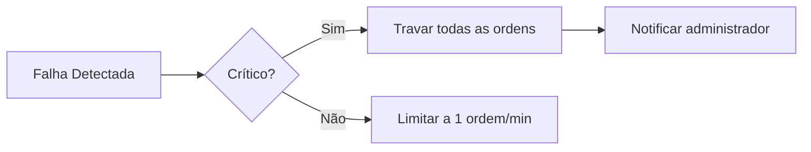

# 🚨 Failover Strategies  
`/Documentação Técnica/05 Gestão de Risco/Failover Strategies.md`  

## 1. Cenários de Falha e Respostas  

### 1.1. Tabela de Contingências  
| Cenário                | Sintomas                     | Ação Imediata                  | Recovery Plan                |  
|------------------------|------------------------------|--------------------------------|------------------------------|  
| **Binance API Offline** | Timeouts (>5s) ou código 5xx | Ativar modo leitura local      | Switch para API alternativa* |  
| **Banco de Dados Down** | Erros de conexão PostgreSQL  | Usar cache Redis por 1h        | Failover para réplica        |  
| **Vazamento de API Key** | Acessos suspeitos            | Revogar chaves via Binance API | Rotação automática de chaves |  

> *Alternativas API: Binance Testnet, CCXT (Coinbase Pro backup)

## 2. Implementação Técnica  

### 2.1. Circuit Breaker Pattern  
```python
from tenacity import retry, stop_after_attempt, wait_exponential

@retry(stop=stop_after_attempt(3), wait=wait_exponential(multiplier=1, min=4, max=10))
def binance_api_call(endpoint: str):
    try:
        return client.get(endpoint)
    except Exception as e:
        log_error(e)
        toggle_fallback_mode(True)
        raise
```

### 2.2. Modo de Degradação Controlada  


## 3. Protocolos de Emergência  

### 3.1. Rotação de Chaves Automática  
```python
def rotate_api_keys():
    new_key = generate_secure_key()
    update_env_file('BINANCE_API_KEY', new_key)
    requests.post(
        'https://api.binance.com/api/v3/account',
        headers={'X-MBX-APIKEY': old_key},
        data={'newApiKey': new_key}
    )
```

### 3.2. Banco de Dados em Read-Only  
```sql
-- Ativar quando primário cair
ALTER DATABASE criptoren SET read_only = ON;
-- Usar réplica
UPDATE strategies SET active_replica = 'secondary-1';
```

## 4. Monitoramento e Alertas  

### 4.1. Métricas Essenciais  
```prometheus
# HELP api_failures_total Total de falhas na API
# TYPE api_failures_total counter
api_failures_total{provider="binance"} 12
```

### 4.2. Gatilhos de Notificação  
```yaml
# alert_rules.yml
- alert: APIBinanceDown
  expr: rate(api_failures_total[5m]) > 5
  labels:
    severity: critical
  annotations:
    summary: "Binance API indisponível"
```

## 5. Plano de Recuperação  

### 5.1. Checklist Pós-Falha  
1. Validar integridade dos dados  
2. Verificar ordens "órfãs" (executadas mas não registradas)  
3. Sincronizar estado com API Binance (`get_account()`)  

### 5.2. Simulação de Desastre  
```bash
# Teste manual (Linux):
sudo iptables -A OUTPUT -p tcp --dport 5432 -j DROP  # Simula falha no PostgreSQL
# Verificar logs do sistema por 5min
sudo iptables -D OUTPUT 1  # Restaura conexão
```

## 6. Próximos Passos  
1. [Configurar réplica do PostgreSQL](../07%20Painel%20e%20Relatório/Evolucao_Temporal.md)  
2. [Documentar procedimentos de rollback](#)  

---

### ✅ Checklist de Implementação  
- [ ] Configurar health checks para todos os serviços críticos  
- [ ] Testar failover manualmente em ambiente staging  
- [ ] Cadastrar contatos de emergência no sistema de alertas  

```python
# Teste rápido de resiliência
python -c "import requests; requests.get('http://localhost:8000/health', timeout=3)"
``` 

--- 

Este documento estabelece protocolos claros para manter a operação estável mesmo em cenários adversos, alinhado às melhores práticas de FinTech.