# 📊 Simulação de Mercado  
`/Documentação Técnica/06 Testes/Simulação de Mercado.md`  

## 1. Arquitetura do Backtester  

```mermaid
graph TD
    A[Dados Históricos] --> B(Preprocessamento)
    B --> C{Módulo de Simulação}
    C --> D[Executor de Estratégias]
    D --> E[Análise de Resultados]
```


## 2. Implementação Básica  

### 2.1. Estrutura de Diretórios  
```bash
backtesting/
├── data/
│   ├── BTCUSDT_4h_2023.csv    # Dados históricos
│   └── loader.py              # Carregamento de dados
├── engine/
│   ├── simulator.py           # Núcleo da simulação
│   └── reports.py             # Geração de relatórios
```

### 2.2. Código do Simulador  
```python
# simulator.py
import pandas as pd

class Backtester:
    def __init__(self, data_path: str):
        self.data = pd.read_csv(data_path, parse_dates=['timestamp'])
        
    def run(self, strategy):
        for idx, candle in self.data.iterrows():
            signal = strategy.check_signal(
                candle['close'],
                candle['volume']
            )
            if signal == 'BUY':
                self.execute_trade('buy', candle['close'])
            elif signal == 'SELL':
                self.execute_trade('sell', candle['close'])
```

## 3. Dados para Simulação  

### 3.1. Obtenção de Dados Históricos  
```python
from binance.client import Client

def fetch_klines(symbol: str, interval: str, days: int):
    client = Client()
    klines = client.get_historical_klines(
        symbol=symbol,
        interval=interval,
        start_str=f"{days} days ago UTC"
    )
    return pd.DataFrame(klines, columns=[
        'timestamp', 'open', 'high', 'low', 'close', 'volume', 
        'close_time', 'quote_asset_volume', 'trades', 
        'taker_buy_base', 'taker_buy_quote', 'ignore'
    ])
```

### 3.2. Exemplo de Dataset (CSV)  
```csv
timestamp,open,high,low,close,volume
2023-01-01 00:00:00,16500.0,16550.0,16480.0,16520.0,1250.25
2023-01-01 04:00:00,16520.0,16600.0,16510.0,16580.0,1420.50
```

## 4. Métricas de Performance  

### 4.1. Cálculos Essenciais  
```python
# reports.py
def calculate_metrics(trades: pd.DataFrame) -> dict:
    wins = trades[trades['profit'] > 0]
    losses = trades[trades['profit'] <= 0]
    
    return {
        'win_rate': len(wins) / len(trades),
        'profit_factor': wins['profit'].sum() / abs(losses['profit'].sum()),
        'max_drawdown': (trades['cumulative'] - trades['cumulative'].cummax()).min()
    }
```

### 4.2. Relatório de Exemplo  
| Métrica               | Valor    | Benchmark |
|-----------------------|----------|-----------|
| Taxa de Acerto        | 68.5%    | >60%      |
| Fator de Lucro        | 2.1      | >1.5      |
| Max Drawdown          | -12.3%   | <20%      |

## 5. Validação da Estratégia  

### 5.1. Walk-Forward Testing  


### 5.2. Parâmetros para Testar  
```python
params_grid = {
    'buy_threshold': [1.0, 1.5, 2.0],
    'sell_threshold': [1.0, 1.5, 2.0],
    'min_profit': [0.3, 0.5, 0.7]
}
```

## 6. Executando a Simulação  

### 6.1. Comando Básico  
```bash
python -m backtesting.engine.simulator \
    --data data/BTCUSDT_4h_2023.csv \
    --strategy CanalStrategy \
    --params '{"buy_threshold": 1.5}'
```

### 6.2. Saída Esperada  
```text
[RESULTS]
Total Trades: 142
Win Rate: 67.6%
Profit Factor: 1.89
Max Drawdown: -14.2%
```

## 7. Próximos Passos  
1. [Integrar com relatórios automatizados](../07%20Painel%20e%20Relatório/Performance_por_Estrategia.md)  
2. [Adicionar Monte Carlo Simulation](#)  

---

### ✅ Checklist de Qualidade  
- [ ] Testar em pelo menos 2 anos de dados históricos  
- [ ] Validar com diferentes pares (BTC, ETH, etc.)  
- [ ] Comparar resultados com benchmark (HODL)  

```bash
# Executar teste rápido
python -m pytest backtesting/tests/test_simulator.py -v
``` 

---

Este documento fornece a base para validação científica da estratégia antes de ir ao vivo, reduzindo riscos operacionais.