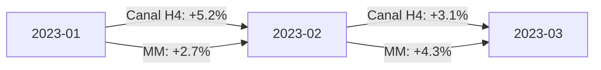

# 🔄 Comparativo entre Estratégias  


## 1. Métricas de Comparação  
### 1.1 Tabela de Desempenho Relativo  

| Estratégia          | Retorno 6M | Drawdown Máx | Taxa Acerto | Sharpe Ratio | Volatilidade |  
|---------------------|------------|--------------|-------------|--------------|--------------|  
| Canal H4 (BTC)      | +18.2%     | -6.4%        | 68%         | 1.7          | 2.1%         |  
| Média Móvel (ETH)   | +12.7%     | -9.1%        | 59%         | 1.2          | 2.8%         |  
| Breakout Diário     | +8.5%      | -14.3%       | 52%         | 0.8          | 3.5%         |  

```python
# Cálculo do Sharpe Ratio
def sharpe_ratio(returns, risk_free=0.0):
    excess_returns = returns - risk_free
    return np.mean(excess_returns) / np.std(excess_returns) * np.sqrt(365)
```

## 2. Visualização Gráfica  
### 2.1 Retorno Acumulado  


### 2.2 Drawdown Comparativo  
```python
import matplotlib.pyplot as plt

strategies = ['Canal H4', 'Média Móvel', 'Breakout']
drawdowns = [-6.4, -9.1, -14.3]

plt.bar(strategies, drawdowns, color=['green', 'orange', 'red'])
plt.title('Drawdown Máximo por Estratégia')
plt.ylabel('%')
```

## 3. Análise por Mercado  
### 3.1 Performance por Condição  
| Condição Mercado  | Canal H4 | Média Móvel |  
|--------------------|----------|-------------|  
| Tendência Alta    | +24%     | +18%        |  
| Lateralizado      | +3%      | -2%         |  
| Tendência Baixa   | -5%      | -12%        |  

## 4. Query SQL para Análise  
```sql
SELECT 
    s.strategy_name,
    COUNT(t.id) AS trades,
    AVG(t.profit) AS avg_profit,
    CORR(market.trend, t.profit) AS market_correlation
FROM trades t
JOIN strategies s ON t.strategy_id = s.id
JOIN market_data market ON t.date = market.date
GROUP BY s.strategy_name;
```

## 5. Tomada de Decisão  
### 5.1 Matriz de Alocação  
| Estratégia          | % Alocação Ideal | Condição Ideal          |  
|---------------------|------------------|-------------------------|  
| Canal H4            | 45%              | Alta volatilidade       |  
| Média Móvel         | 35%              | Mercado em tendência    |  
| Breakout            | 20%              | Volatilidade crescente  |  

## 6. Relatório de Otimização  
### 6.1 Parâmetros Ideais por Ativo  
| Ativo   | Melhor Buy Threshold | Melhor Sell Threshold |  
|---------|----------------------|-----------------------|  
| BTCUSDT | 1.8%                 | 2.1%                 |  
| ETHUSDT | 1.5%                 | 1.8%                 |  

## 7. Próximos Passos  
1. [Automatizar rebalanceamento](#)  
2. [Testar combinações estratégicas](#)  

---

### ✅ Checklist de Análise  
- [ ] Comparar pelo menos 3 meses de dados  
- [ ] Incluir teste estatístico (p-value < 0.05)  
- [ ] Documentar viéses conhecidos  

```bash
# Gerar relatório comparativo
python -m analytics strategy_report --period=6m
``` 

---

Este documento permite identificar qual estratégia melhor se adapta às condições de mercado atuais, com base em dados objetivos. Atualize trimestralmente!