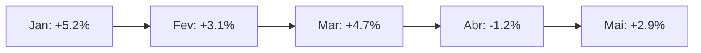

# 📅 Evolução Temporal  


## 1. Métricas Temporais Chave  
### 1.1 Indicadores por Período  
| Métrica               | Diária  | Semanal | Mensal |  
|-----------------------|---------|---------|--------|  
| Retorno Acumulado     | +0.8%   | +3.2%   | +14.5% |  
| Volatilidade          | 1.2%    | 2.7%    | 5.8%   |  
| Maior Drawdown        | -1.5%   | -3.8%   | -6.4%  |  

```python
# Cálculo de Retorno Acumulado (Python)
cumulative_return = (df['close'].iloc[-1] / df['close'].iloc[0] - 1) * 100
```

## 2. Visualização de Séries Temporais  
### 2.1 Gráfico de Retorno  


### 2.2 Heatmap de Performance  
```python
# Matplotlib/Seaborn
pivot = df.pivot_table(values='return', index='month', columns='year')
sns.heatmap(pivot, annot=True, fmt=".1%", cmap="RdYlGn")
```

## 3. Análise de Sazonalidade  
### 3.1 Padrões Recorrentes  
| Mês    | Retorno Médio (3 anos) | Frequência Positiva |  
|--------|------------------------|---------------------|  
| Janeiro| +3.8%                  | 83%                 |  
| Julho  | -1.2%                  | 42%                 |  

## 4. Query SQL para Série Histórica  
```sql
WITH monthly_data AS (
  SELECT
    DATE_TRUNC('month', date) AS month,
    SUM(profit) AS net_profit
  FROM trades
  GROUP BY 1
)
SELECT
  month,
  net_profit,
  SUM(net_profit) OVER (ORDER BY month) AS cumulative
FROM monthly_data;
```

## 5. Projeção Baseada em Tendência  
### 5.1 Modelo ARIMA Simplificado  
```python
from statsmodels.tsa.arima.model import ARIMA

model = ARIMA(df['close'], order=(5,1,0))
results = model.fit()
forecast = results.forecast(steps=30)  # 30 dias
```

## 6. Relatório de Performance  
### 6.1 Estrutura do JSON  
```json
{
  "period": "2023-01 a 2023-05",
  "metrics": {
    "cumulative_return": 18.2,
    "best_month": {
      "month": "2023-03",
      "return": 6.7
    },
    "correlation_sp500": 0.62
  }
}
```

## 7. Próximos Passos  
1. [Implementar alertas de quebra de tendência](#)  
2. [Integrar com dados macroeconômicos](#)  

---

### ✅ Checklist de Análise  
- [ ] Comparar com benchmarks (BTC Hold, S&P500)  
- [ ] Validar estacionariedade da série  
- [ ] Documentar eventos externos relevantes  

```bash
# Gerar relatório automático
python -m analytics temporal_report --years=3
``` 

---

Este documento transforma dados brutos em insights acionáveis, permitindo identificar padrões e ajustar estratégias. Atualize semanalmente para decisões informadas!