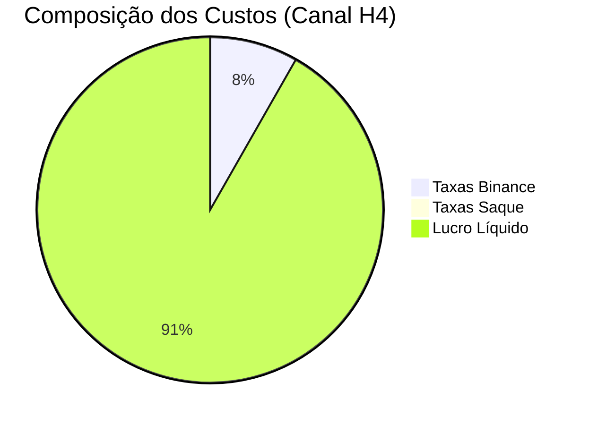

# 💸 Impacto das Taxas  
`/Documentação Técnica/07 Painel e Relatório/Impacto_Taxas.md`  

## 1. Estrutura de Custos  
### 1.1 Composição das Taxas Binance  
| Tipo Taxa          | Maker | Taker | Como Reduzir              |  
|--------------------|-------|-------|---------------------------|  
| Spot Trading       | 0.10% | 0.10% | Usar ordens limit         |  
| BNB Discount      | 0.075%| 0.075%| Manter saldo em BNB       |  
| Volume > 50BTC    | 0.07% | 0.09% | Agrupar ordens grandes    |  

```python
# Cálculo Automatizado
def calc_fees(order_type: str, amount: float, bnb_discount: bool):
    base_fee = 0.001  # 0.10%
    if bnb_discount:
        base_fee *= 0.75  # 25% discount
    return amount * base_fee
```

## 2. Análise de Impacto  
### 2.1 Comparativo por Estratégia  
| Estratégia          | Taxas/Mês | % do Lucro | Operações/Mês |  
|---------------------|-----------|------------|---------------|  
| Canal H4 (BTC)      | $142.50   | 8.2%       | 38            |  
| Scalping (ETH)      | $320.80   | 22.7%      | 215           |  

## 3. Visualização do Impacto  
### 3.1 Proporção Taxas/Lucro  


### 3.2 Evolução Mensal  
```python
import plotly.express as px
fig = px.line(
    df, 
    x='month', 
    y=['gross_profit', 'net_profit'],
    title='Lucro Bruto vs. Líquido'
)
fig.show()
```

## 4. Estratégias de Otimização  
### 4.1 Técnicas Comprovadas  
- **Agrupamento de Ordens**: Reduzir operações abaixo de 0.5 BTC  
- **BNB Holding**: Manter 1-2 BNB para desconto contínuo  
- **Horário Otimizado**: Operar em janelas de maior liquidez (menor spread)  

### 4.2 Query de Identificação  
```sql
SELECT 
    strftime('%H', executed_at) AS hour,
    AVG(fees/amount) AS avg_fee_rate,
    COUNT(*) AS trades_count
FROM trades
GROUP BY 1
ORDER BY 2 ASC;
```

## 5. Simulação de Cenários  
### 5.1 Comparativo de Modelos  
| Cenário             | Taxa Média | Lucro Anual Projetado |  
|---------------------|------------|-----------------------|  
| Atual               | 0.085%     | $5,200                |  
| +BNB +Agrupamento   | 0.063%     | $5,800 (+11.5%)       |  
| Only Market Orders  | 0.120%     | $4,600 (-13.4%)       |  

## 6. Relatório de Recomendações  
1. **Priorizar ordens limit** durante alta volatilidade  
2. **Manter saldo mínimo** de 1 BNB na conta  
3. **Revisar** operações abaixo de $200 (impacto relativo maior)  

## 7. Próximos Passos  
1. [Automatizar cálculo de custos](#)  
2. [Integrar alertas de taxa excessiva](#)  

---

### ✅ Checklist de Implementação  
- [ ] Configurar monitoramento contínuo de taxas  
- [ ] Testar estratégias de agrupamento em sandbox  
- [ ] Documentar política de uso de BNB  

```bash
# Simular economia com BNB
python -m analytics fee_simulator --bnb --volume 50000
``` 

---

Este documento revela como pequenas otimizações podem aumentar significativamente o lucro líquido. Atualize trimestralmente conforme mudanças na estrutura de taxas!