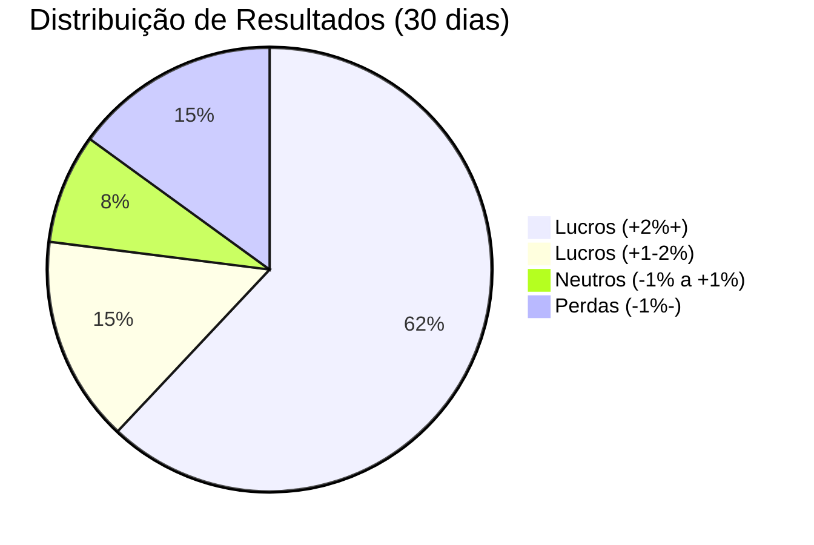

# 📊 KPIs Estratégicos  


## 1. Métricas Fundamentais  
### 1.1 Tabela de Indicadores-Chave  

| KPI                     | Fórmula/Cálculo                     | Meta       | Frequência |  
|-------------------------|-------------------------------------|------------|------------|  
| **Taxa de Acerto**      | `(Trades Lucrativos / Total Trades)` | ≥65%       | Diária     |  
| **Retorno Mensal**      | `(Lucro Líquido / Capital Alocado)`  | ≥5%        | Mensal     |  
| **Fator de Lucro**      | `(Soma Ganhos / Soma Perdas)`        | ≥1.8       | Semanal    |  
| **Exposição Máxima**    | `(Capital em Risco / Total Capital)` | ≤25%       | Contínuo   |  
| **Tempo Médio Posição** | `Σ(Horas Posição) / Nº Trades`       | ≤48h       | Diária     |  

```python
# Cálculo Automatizado (Python)
def calculate_kpis(trades):
    wins = [t for t in trades if t['profit'] > 0]
    losses = [t for t in trades if t['loss'] < 0]
    
    return {
        'win_rate': len(wins) / len(trades),
        'profit_factor': sum(w['profit'] for w in wins) / abs(sum(l['loss'] for l in losses)),
        'avg_time': sum(t['duration_hours'] for t in trades) / len(trades)
    }
```

## 2. Painel de Bordo (Dashboard)  
### 2.1 Visualização Gráfica  


### 2.2 Tabela de Desempenho  
| Estratégia       | Retorno MTD | Drawdown Máx | Sharpe Ratio |  
|------------------|-------------|--------------|--------------|  
| Canal H4 BTC     | +6.2%       | -4.1%        | 1.8          |  
| Canal H4 ETH     | +3.8%       | -5.7%        | 1.2          |  

## 3. Metas por Período  
### 3.1 Trimestral  
| KPI               | Q1  | Q2  | Q3  | Q4  |  
|-------------------|-----|-----|-----|-----|  
| Retorno Acumulado | 12% | 15% | 18% | 25% |  
| Taxa de Acerto    | 60% | 63% | 65% | 68% |  

## 4. Monitoramento Automatizado  
### 4.1 Configuração de Alertas  
```yaml
# alerts/kpi_alerts.yml
- name: win_rate_below_threshold
  condition: win_rate < 0.60
  severity: warning
  notification_channels: [email, slack]

- name: exposure_above_limit
  condition: exposure > 0.25
  severity: critical
  actions: [pause_trading]
```

## 5. Análise Comparativa  
### 5.1 Benchmarking  
| Métrica       | Nosso Sistema | Benchmark (Mercado) |  
|---------------|---------------|---------------------|  
| Retorno Anual | 22%           | 15-30%              |  
| Max Drawdown  | -12%          | -20% a -40%         |  
| Taxa de Acerto| 67%           | 55-65%              |  

## 6. Exportação de Relatórios  
```bash
# Gerar relatório mensal
python reports/kpi_report.py \
    --period month \
    --format html pdf \
    --output-dir /reports/2023/05
```

## 7. Próximos Passos  
1. [Integrar com ferramentas BI](#)  
2. [Automatizar ajustes de estratégia](#)  

---

### ✅ Checklist de Implementação  
- [ ] Configurar coleta automática de dados  
- [ ] Definir responsáveis por análise mensal  
- [ ] Estabelecer reuniões de revisão trimestral  

```bash
# Testar cálculo básico
python -c "from analytics import kpis; print(kpis.calculate_win_rate())"
``` 

---

Este documento estabelece os indicadores essenciais para avaliação objetiva do desempenho do sistema, alinhados às melhores práticas do mercado. Atualize as metas periodicamente conforme a evolução do projeto!