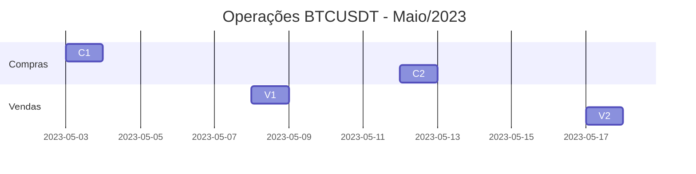
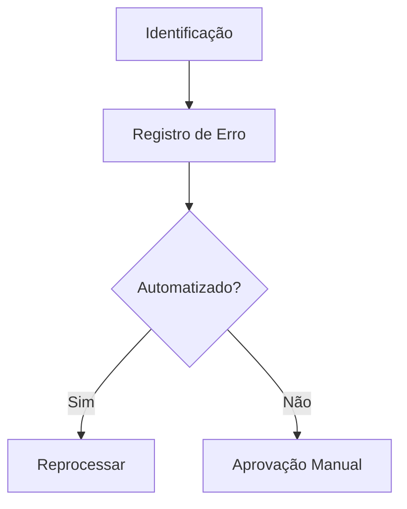

# 📝 Operações Individuais  


## 1. Estrutura do Registro  
### 1.1 Campos Obrigatórios  
```typescript
interface Trade {
  id: string;
  data: Date;
  par: string;           // Ex: "BTCUSDT"
  tipo: 'compra' | 'venda';
  preco_entrada: number; // Preço de execução
  preco_saida?: number;  // Preenchido para vendas
  volume: number;        // Quantidade da moeda base
  taxas: number;         // Em USDT
  lucro?: number;        // Calculado automaticamente
  motivo: 'estrategia' | 'rompimento' | 'manual';
}
```

## 2. Exemplo de Entrada  
```json
{
  "id": "TRD-2023-0154",
  "data": "2023-05-15T14:30:00Z",
  "par": "ETHUSDT",
  "tipo": "venda",
  "preco_entrada": 1850.50,
  "preco_saida": 1923.75,
  "volume": 2.5,
  "taxas": 1.20,
  "lucro": 180.63,
  "motivo": "rompimento",
  "duracao_horas": 42
}
```

## 3. Queries de Análise  

### 3.1 Busca por Período (SQL)  
```sql
SELECT 
  id,
  par,
  tipo,
  preco_entrada,
  lucro,
  motivo
FROM trades
WHERE data BETWEEN '2023-05-01' AND '2023-05-31'
ORDER BY data DESC
LIMIT 50;
```

### 3.2 Estatísticas por Motivo  
```python
# Pandas Analysis
df.groupby('motivo')['lucro'].agg(['count', 'mean', 'sum'])
```

| Motivo      | Qtd Operações | Lucro Médio | Lucro Total |  
|-------------|---------------|-------------|-------------|  
| estratégia  | 124           | +1.8%       | +2230 USDT  |  
| rompimento  | 37            | +0.5%       | +185 USDT   |  

## 4. Visualizações  

### 4.1 Timeline Interativa  


### 4.2 Heatmap de Rentabilidade  
```python
# Matplotlib/Seaborn
sns.heatmap(
    pd.crosstab(df['hora_dia'], df['dia_semana'], values=df['lucro'], aggfunc='mean'),
    annot=True, fmt=".1%"
)
```

## 5. Exportação de Dados  
### 5.1 Formatos Suportados  
- CSV (Padrão)  
- JSON (API)  
- PDF (Relatório)  

```bash
# Exemplo via CLI
python export_trades.py --format=json --date=2023-05 --output=may_trades.json
```

## 6. Auditoria e Ajustes  
### 6.1 Fluxo de Correção  


## 7. Próximos Passos  
1. [Integrar com sistema de alertas](#)  
2. [Configurar webhooks para novas operações](#)  

---

### ✅ Checklist de Qualidade  
- [ ] 100% das operações com motivo registrado  
- [ ] Validação diária de lucro/taxas  
- [ ] Backup automático mensal  

```bash
# Verificar consistência
python -m validator trades_202305.csv --check=all
``` 

---

Este documento permite rastrear cada operação com granularidade, essencial para otimização da estratégia. Mantenha registros históricos por pelo menos 2 anos!