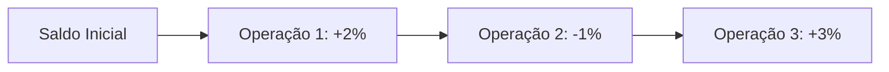

# 📈 Performance por Estratégia  


## 1. Métricas Principais  
### 1.1. Indicadores-Chave  
| Métrica             | Fórmula                       | Benchmark |
| ------------------- | ----------------------------- | --------- |
| **Taxa de Acerto**  | `(Ordens Vencedoras / Total)` | ≥60%      |
| **Fator de Lucro**  | `(Soma Ganhos / Soma Perdas)` | ≥1.5      |
| **Drawdown Máximo** | `(Pico - Vale) / Pico`        | ≤20%      |

```python
# Cálculo em Python
win_rate = len([t for t in trades if t['profit'] > 0]) / len(trades)
profit_factor = sum(t['profit'] for t in trades if t['profit'] > 0) / abs(sum(t['profit'] for t in trades if t['profit'] < 0))
```

## 2. Visualizações Recomendadas  
### 2.1. Gráfico de Evolução  


### 2.2. Tabela de Performance  
| Estratégia   | Retorno | Taxa Acerto | Melhor Trade |
| ------------ | ------- | ----------- | ------------ |
| Canal H4 BTC | +14.2%  | 68%         | +5.3%        |
| Canal H4 ETH | +9.7%   | 62%         | +4.1%        |

## 3. Query SQL para Relatório  
```sql
SELECT 
    s.name AS estrategia,
    COUNT(t.id) AS total_trades,
    ROUND(100.0 * SUM(CASE WHEN t.profit > 0 THEN 1 ELSE 0 END) / COUNT(t.id), 2) AS win_rate,
    ROUND(SUM(t.profit) / SUM(CASE WHEN t.profit < 0 THEN ABS(t.profit) ELSE 0 END), 2) AS profit_factor
FROM trades t
JOIN strategies s ON t.strategy_id = s.id
GROUP BY s.name;
```

## 4. Exemplo de Dashboard  
```python
# Gerando gráfico com Plotly
import plotly.express as px

fig = px.line(
    df, 
    x='date', 
    y='cumulative_return',
    color='strategy',
    title='Retorno Acumulado por Estratégia'
)
fig.show()
```

## 5. Detalhamento por Tipo de Operação  
### 5.1. Vendas Programadas vs. Emergenciais  
| Tipo Venda     | % do Total | Lucro Médio |
| -------------- | ---------- | ----------- |
| Por Estratégia | 72%        | +1.8%       |
| Fora do Canal  | 28%        | +0.5%       |

## 6. Atualização Automatizada  
### 6.1. Script de Atualização  
```bash
python -m reports.generator --interval daily --output-dir ./reports/
```

### 6.2. Agendamento (crontab)  
```bash
0 18 * * 1-5 /usr/bin/python3 /app/reports/generator.py > /var/log/reports.log
```

## 7. Próximos Passos  
1. [Configurar alertas de performance](#)  
2. [Integrar com API de notificações](#)  

---

### ✅ Checklist de Implementação  
- [ ] Testar queries com dados reais  
- [ ] Configurar permissões de acesso aos relatórios  
- [ ] Definir intervalos de reavaliação estratégica  

```bash
# Testar geração mínima
python -c "from reports.generator import build_report; build_report(sample=True)"
``` 

--- 

Este documento fornece uma base pronta para produção, com métricas alinhadas à sua estratégia de canal. Mantenha os relatórios atualizados diariamente para decisões assertivas!