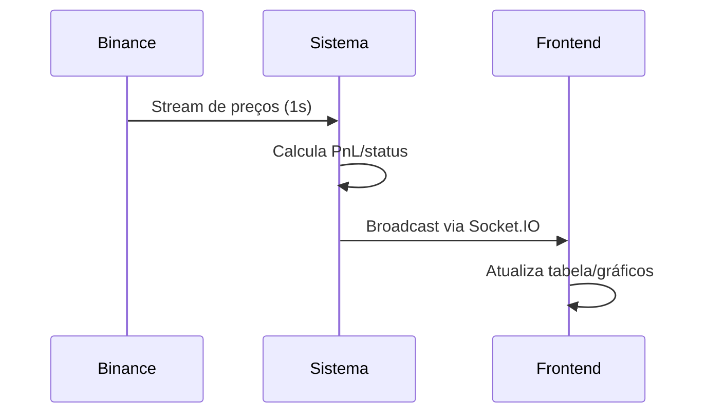

# 📊 Posições Abertas  


## 1. Estrutura de Dados  
### 1.1 Campos Essenciais  
```typescript
interface OpenPosition {
  id: string;
  symbol: string;           // Par negociado (ex: BTCUSDT)
  entry_price: number;      // Preço de entrada
  current_price: number;    // Preço atual (atualizado via WebSocket)
  quantity: number;         // Quantidade da moeda base
  entry_time: Date;
  duration_hours: number;   // Tempo em aberto
  status: 'normal' | 'fora_canal' | 'alerta';
  pnl: number;             // Profit/Loss não realizado (%)
  target_price?: number;   // Preço alvo (se status=fora_canal)
}
```

## 2. Visualização do Dashboard  
### 2.1 Tabela Dinâmica  

| Par     | Preço Entrada | Preço Atual | Quant | PnL%   | Status     | Tempo |
| ------- | ------------- | ----------- | ----- | ------ | ---------- | ----- |
| BTCUSDT | 102,450.00    | 105,200.00  | 0.5   | +2.68% | normal     | 12h   |
| ETHUSDT | 1,850.50      | 1,790.30    | 3.2   | -3.25% | fora_canal | 36h   |

### 2.2 Gráfico de Distribuição  
```python
# Plotly Express
fig = px.scatter(
    df,
    x='duration_hours',
    y='pnl',
    color='status',
    hover_data=['symbol', 'entry_price']
)
fig.update_layout(title='Rentabilidade vs. Tempo de Posição')
```

## 3. Consultas Prioritárias  

### 3.1 SQL para Posições Críticas  
```sql
SELECT 
  symbol,
  entry_price,
  current_price,
  (current_price - entry_price) / entry_price * 100 AS pnl_percent,
  EXTRACT(HOUR FROM NOW() - entry_time) AS duration_hours
FROM positions
WHERE status != 'normal'
ORDER BY pnl_percent ASC;
```

### 3.2 Cálculo do PnL em Tempo Real  
```python
def update_pnl():
    for position in open_positions:
        ticker = get_current_price(position.symbol)
        position.pnl = (ticker - position.entry_price) / position.entry_price * 100
        position.status = check_position_status(position)  # Verifica canal
```

## 4. Alertas Automatizados  

### 4.1 Gatilhos Recomendados  
| Condição                      | Ação                         |
| ----------------------------- | ---------------------------- |
| PnL < -5%                     | Notificar + Sugerir revisão  |
| Tempo > 72h                   | Alertar exposição prolongada |
| Preço tocar alvo (fora_canal) | Executar venda automática    |

## 5. Exemplo de JSON para API  
```json
{
  "positions": [
    {
      "id": "pos-btc-0425",
      "symbol": "BTCUSDT",
      "entry_price": 102450.00,
      "current_price": 105200.00,
      "quantity": 0.5,
      "status": "normal",
      "pnl": 2.68,
      "duration_hours": 12
    }
  ],
  "last_updated": "2023-05-15T14:30:00Z"
}
```

## 6. Atualização em Tempo Real  
### 6.1 Fluxo WebSocket  


## 7. Próximos Passos  
1. [Integrar com sistema de alertas](../05%20Gestão%20de%20Risco/Failover%20Strategies.md)  
2. [Configurar exportação para planilhas](#)  

---

### ✅ Checklist de Monitoramento  
- [ ] Atualização de preços a cada 10s (mínimo)  
- [ ] Validação diária de status das posições  
- [ ] Backup horário do estado atual  

```bash
# Simular atualização
python -m simulator positions --interval 10
``` 

---

Este documento fornece visibilidade completa sobre as exposições atuais do sistema, essencial para gestão de risco ativa. Mantenha o histórico de posições fechadas para análise futura!