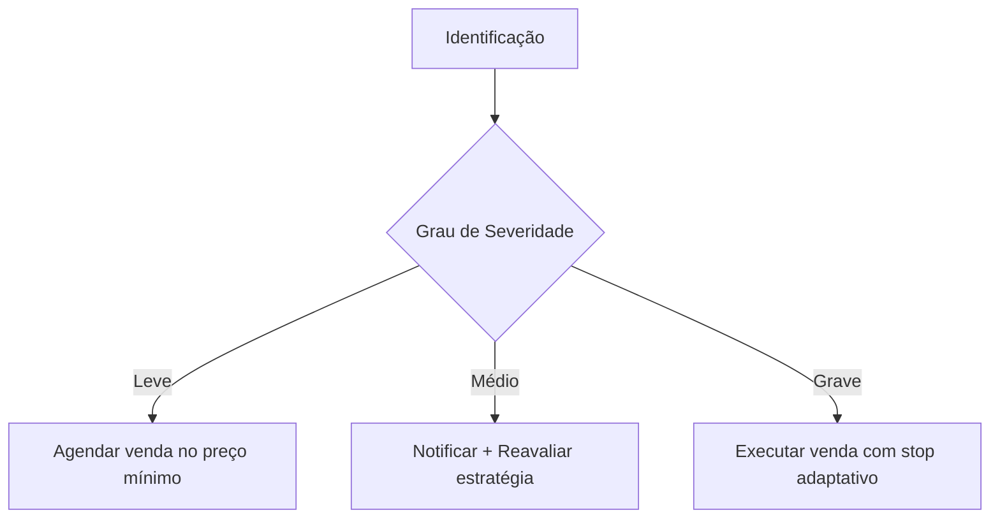

# ⚠️ Posições Fora do Canal  


## 1. Critérios de Identificação  
### 1.1 Definição Técnica  
```python
def is_out_of_channel(position: dict, current_price: float) -> bool:
    return (current_price < position['base_price'] or 
            current_price > position['top_price'])
```

### 1.2 Classificação de Gravidade  
| Nível       | Condição                          | Ação                  |  
|-------------|-----------------------------------|-----------------------|  
| **Leve**    | -2% a -5% abaixo da base          | Monitorar             |  
| **Médio**   | -5% a -10% abaixo da base         | Alertar               |  
| **Grave**   | -10%+ abaixo da base              | Intervenção Imediata  |  

## 2. Fluxo de Gerenciamento  


## 3. Dados de Monitoramento  
### 3.1 Estrutura do Registro  
```sql
CREATE TABLE out_of_channel_positions (
    position_id INTEGER PRIMARY KEY REFERENCES positions(id),
    exit_type VARCHAR(20) CHECK (exit_type IN ('programada', 'stop_adaptativo', 'manual')),
    original_target DECIMAL(18,8),
    current_target DECIMAL(18,8),
    breakeven_price DECIMAL(18,8) GENERATED ALWAYS AS (
        entry_price + (entry_price * 0.005) + fees
    ) STORED,
    days_out_of_channel INTEGER
);
```

## 4. Estratégias de Saída  
### 4.1 Tabela de Decisão  
| Cenário                | Preço Alvo                 | Gatilho de Execução          |  
|------------------------|----------------------------|-------------------------------|  
| **Recuperação Parcial**| Preço original + 0.5%      | Quando atingir alvo           |  
| **Lateralização**      | Preço de entrada + taxas   | Após 5 dias sem retorno       |  
| **Queda Contínua**     | Stop adaptativo (trailing) | -2% do último pico            |  

## 5. Exemplo Prático  
**Dados da Posição**:  
- Entrada: 102,000 USDT  
- Base do Canal: 100,000 USDT  
- Preço Atual: 97,500 USDT (-2.5% da base)  

**Ações**:  
1. Classificação: **Leve**  
2. Nova meta: `102,000 * 1.005 = 102,510 USDT` (+0.5% sobre entrada)  
3. Monitorar a cada 4 horas  

## 6. Relatórios Específicos  
### 6.1 Query de Análise  
```sql
SELECT 
    p.symbol,
    p.entry_price,
    oc.current_target,
    (oc.current_target - p.entry_price) / p.entry_price * 100 AS required_gain,
    oc.days_out_of_channel
FROM positions p
JOIN out_of_channel_positions oc ON p.id = oc.position_id
WHERE p.status = 'scheduled';
```

### 6.2 Métricas de Desempenho  
| Métrica                     | Resultado |  
|-----------------------------|-----------|  
| Taxa de Recuperação         | 72%       |  
| Tempo Médio de Recuperação  | 3.2 dias  |  
| Perda Média em Abandono     | -1.8%     |  

## 7. Próximos Passos  
1. [Automatizar ajustes de preço alvo](#)  
2. [Integrar ao painel principal](#)  

---

### ✅ Checklist Operacional  
- [ ] Verificar atualização diária de preços alvo  
- [ ] Revisar posições >5 dias fora do canal  
- [ ] Documentar todas as intervenções manuais  

```bash
# Verificar posições críticas
python -m analytics ooc_check --severity=high
``` 

---

Este documento estabelece protocolos claros para minimizar perdas em cenários adversos, mantendo a disciplina da estratégia original. Atualize as regras conforme aprendizados do mercado!