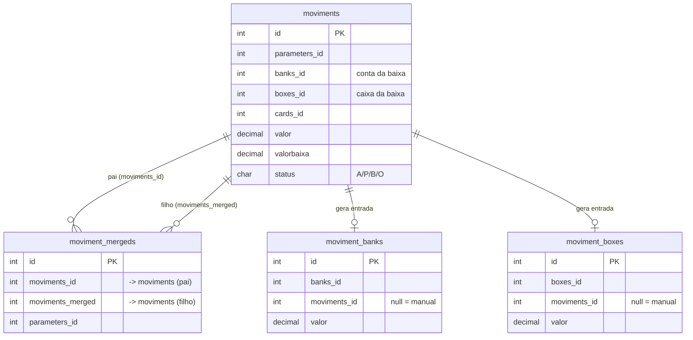
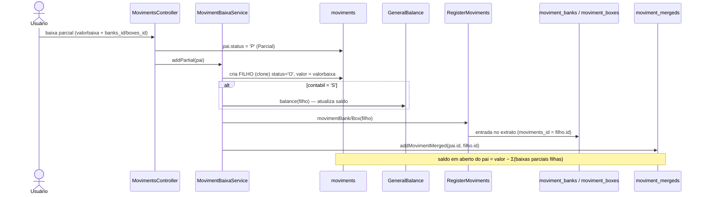
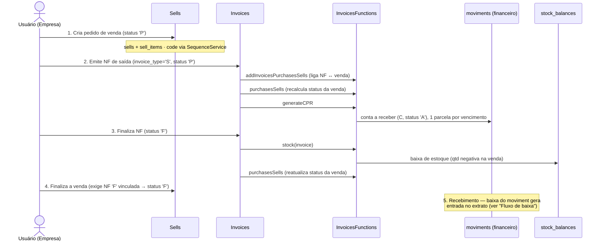

# Reiniciando Sistemas — Documentação do Sistema

**Versão documentada:** CakePHP 3.4.14 / PHP 7.4.33 / MariaDB 11.8.8 / AdminLTE + Bootstrap 3.3.7 + jQuery 3.5.1

**Organização deste documento:** um arquivo único, dividido em blocos por módulo ou categoria funcional. O volume atual não justifica arquivos separados por pasta de módulo. Blocos de funcionalidades exclusivas do Super estão reunidos em seção própria ao final, em vez de distribuídos em cada módulo.

---

## Sumário

1. [Stack e Infraestrutura](#1-stack-e-infraestrutura)
2. [Arquitetura Multi-Tenant](#2-arquitetura-multi-tenant)
3. [Planos de Assinatura](#3-planos-de-assinatura)
4. [Sistema de Permissões e Acesso](#4-sistema-de-permissoes-e-acesso)
5. [Fluxo de Login e Sessão](#5-fluxo-de-login-e-sessao)
6. [Organização do Código](#6-organizacao-do-codigo)
7. [Módulo: Contas a Pagar/Receber (Moviments)](#7-modulo-contas-a-pagarreceber-moviments)
8. [Módulo: Extratos Bancários (MovimentBanks)](#8-modulo-extratos-bancarios-movimentbanks)
9. [Módulo: Extratos de Caixa (MovimentBoxes)](#9-modulo-extratos-de-caixa-movimentboxes)
10. [Módulo: Lançamentos de Cartão (MovimentCards)](#10-modulo-lancamentos-de-cartao-movimentcards)
11. [Módulo: Transferências (Transfers)](#11-modulo-transferencias-transfers)
12. [Módulo: Planejamentos](#12-modulo-planejamentos)
13. [Módulo: Saldos Financeiros (Balances)](#13-modulo-saldos-financeiros-balances)
14. [Módulo: Produtos e Cadastros de Estoque](#14-modulo-produtos-e-cadastros-de-estoque)
15. [Módulo: Compras (Purchases)](#15-modulo-compras-purchases)
16. [Módulo: Vendas (Sells)](#16-modulo-vendas-sells)
17. [Módulo: Requisições (Requisitions)](#17-modulo-requisicoes-requisitions)
18. [Módulo: Inventários (Inventories)](#18-modulo-inventarios-inventories)
19. [Módulo: Industrialização (Industrializations)](#19-modulo-industrializacao-industrializations)
20. [Módulo: Saldos de Estoque (StockBalances)](#20-modulo-saldos-de-estoque-stockbalances)
21. [Módulo: Notas Fiscais (Invoices)](#21-modulo-notas-fiscais-invoices)
22. [Cadastros de Apoio Financeiro](#22-cadastros-de-apoio-financeiro)
23. [Cadastros de Apoio de Estoque](#23-cadastros-de-apoio-de-estoque)
24. [Cadastros de Pessoas (Customers, Providers, Transporters)](#24-cadastros-de-pessoas-customers-providers-transporters)
25. [Assinaturas (Stripe)](#25-assinaturas-stripe)
26. [Tarefas Automáticas (Cron)](#26-tarefas-automaticas-cron)
27. [Particularidades e Regras de Negócio Transversais](#27-particularidades-e-regras-de-negocio-transversais)
28. [Telas Complementares do Dashboard (drill-down)](#28-telas-complementares-do-dashboard-drill-down)
29. [Padrões Visuais e de UI](#29-padroes-visuais-e-de-ui)
30. [Segurança](#30-seguranca)
31. [Funcionalidades Exclusivas do Usuário Super](#31-funcionalidades-exclusivas-do-usuario-super)

---

## 1. Stack e Infraestrutura

| Componente | Versão |
|---|---|
| Linguagem | PHP 7.4.33 |
| Framework | CakePHP 3.4.14 |
| Banco de dados | MariaDB 11.8.8 (banco principal: `reinicia_financeiro`) |
| Template engine | CTP (PHP nativo, server-rendered — sem build de front-end) |
| UI | AdminLTE + Bootstrap 3.3.7 + jQuery 3.5.1 |
| Servidor local | Apache (XAMPP) |
| Servidor de produção | nginx (`.htaccess` ignorado em produção) |
| Internacionalização | `Cake\I18n\I18n`; strings de interface via `__()` |
| Idioma do projeto | Português (comentários, commits, UI) |

Além do português (idioma padrão da interface), há uma **versão em inglês (`en_US`) revisada** das strings de interface em `src/Locale/en_US/default.po`.

O banco de testes (`reinicia_financeiro_test`) é separado do principal. Scripts de criação em `Documents/cria banco de teste.bat`. Dumps e scripts de restauração em `Documents/`.

Migrações de banco executadas em produção ficam em `webroot/database/`, nomeadas por data (`YYYYMMDD descrição.sql`). Após executadas em produção, os arquivos são apagados. Nunca editar um arquivo já executado — criar sempre um novo com a data atual. Após qualquer `ALTER TABLE`, executar `php bin/cake.php orm_cache clear` para que o ORM reconheça as novas colunas.

---

## 2. Arquitetura Multi-Tenant

O sistema usa multi-tenancy por "perfil" (`parameters`). Cada empresa, pessoa ou contexto de uso é um registro na tabela `parameters`. O perfil ativo é armazenado na sessão como `sessionParameterControl`.

Um usuário pode pertencer a mais de um perfil. A relação é mantida em `users_parameters`. A troca de perfil é feita em `UsersParametersController::changeParameter`. O sistema identifica o último perfil usado pelo usuário e o reativa na sessão após o login.

Quase toda tabela tem a coluna `parameters_id`, e toda query de negócio deve filtrá-la pelo valor da sessão. O padrão dominante é:

```php
$this->Model->findByParametersId($this->request->Session()->read('sessionParameterControl'))
```

A ausência de `parameters_id` em uma query de mutação é um ponto de atenção de IDOR (acesso cross-perfil). Ver seção de Segurança.

---

## 3. Planos de Assinatura

Apenas dois planos ativos:

| ID | Nome | Descrição |
|---|---|---|
| 1 | Pessoal | Financeiro simplificado, sem módulos de estoque/faturamento. |
| 3 | Empresa | Acesso completo a financeiro e estoque. |

Os planos 2 (Simples) e 4 (Limitado) foram descontinuados. Os IDs não foram renumerados.

O plano do perfil é determinado pelo campo `Parameters.plans_id`. Durante o `beforeFilter` de cada request, `SystemFunctionsComponent::validatePlans()` verifica o plano e toma as seguintes ações:

- **Plano Pessoal (1):** redireciona as actions `index`, `add`, `edit`, `view`, `editBaixado`, `low` e `reportForm` dos módulos financeiros para suas variantes `*Simple` (`indexSimple`, `addSimple`, etc.), que renderizam templates em `Template/<Modulo>/simple/`.
- **Plano Empresa (3):** não acessa telas `*Simple`. Se uma URL `*Simple` for acessada diretamente, é redirecionada para a versão completa equivalente.

Nomenclaturas que diferem entre planos:

| Tabela/Módulo | Nome no Plano Pessoal | Nome no Plano Empresa |
|---|---|---|
| `costs` | Categorias | Centro de Custos |
| `boxes` | Carteira | Caixa |

**Restrições de controller por plano** (checagem pelo `validatePlanController`, válida inclusive para o Super). Os dois planos usam modelos opostos:

- **Plano Pessoal (1) — allowlist (`planControllers[1]`), modelo *default-deny*:** só pode acessar os controllers explicitamente listados; **todo controller fora da lista é bloqueado** e redirecionado ao dashboard. Controllers próprios do Pessoal:

  `Moviments`, `MovimentBanks`, `MovimentBoxes`, `MovimentCards`, `Transfers`, `Costs`, `Banks`, `Boxes`, `Cards`, `Plannings`

  Somados aos **controllers comuns** (`commonControllers`, liberados em qualquer plano): `Pages`, `Users`, `Parameters`, `UsersParameters`, `SupportContacts`, `Knowledges`, `Settings`, `Cron`, `Regs`, `Backups`, `SystemLogs`, `IpBlocker`, `Error`, `App`, `Balances`, `FeatureUsages`, `Subscriptions`, `StripeWebhooks`.

  Além do *default-deny*, o Pessoal tem uma **denylist própria** (`planDeniedControllers[1] = ['StockBalances']`): `StockBalances` (Saldos de Estoque) é vedado ao Pessoal. Ele já cairia na regra *default-deny* (não está na allowlist), mas fica na denylist para que o bloqueio seja registrado como `info` (política intencional) em vez de `error` (tela legítima faltante).

- **Plano Empresa (3) — sem allowlist (`planControllers[3] = null`) + denylist (`planDeniedControllers[3]`):** alcança todos os controllers, exceto os explicitamente vedados: `Cards`, `MovimentCards`, `Plannings`. `StockBalances` é acessível no Empresa (não consta da denylist do plano 3).

**Consequência para os módulos exclusivos do Empresa (bloqueados no Plano Pessoal):** como o Pessoal é *default-deny*, todos os módulos abaixo — **incluindo todas as suas actions de relatório** — são inacessíveis ao plano Pessoal (não constam da allowlist):

| Módulo | Controller(s) bloqueado(s) no Pessoal |
|---|---|
| Plano de Contas | `AccountPlans` |
| Tipos de Documento | `DocumentTypes` |
| Tipos de Evento | `EventTypes` |
| Produtos | `Products` |
| Tipos de Produto | `ProductTypes` |
| Grupos de Produto | `ProductGroups` |
| Inventário | `Inventories` |
| Pedidos de Compra / Solicitações | `Purchases`, `PurchaseRequests` |
| Vendas | `Sells` |
| Requisições | `Requisitions` |
| Industrialização | `Industrializations` |
| Notas Fiscais | `Invoices` |
| Saldos de Estoque | `StockBalances` (via denylist `planDeniedControllers[1]`) |
| Clientes / Fornecedores / Transportadoras | `Customers`, `Providers`, `Transporters` |

Como a checagem é por **controller**, ela cobre automaticamente todas as actions daquele controller — inclusive `reportForm`, `report`, `cashFlow` e demais relatórios. Não é preciso listar action por action.

> `StockBalances` era, até então, um controller comum (`commonControllers`) — o único módulo de estoque tecnicamente alcançável pelo Pessoal. Foi removido de `commonControllers` e vedado ao Pessoal via denylist, ficando **exclusivo do Empresa**. Sua exibição no menu depende ainda do módulo do usuário (ver abaixo).

**Duas camadas independentes de restrição por plano:**
1. **Restrição de controller** (esta seção, `validatePlanController`): bloqueia módulos inteiros que não pertencem ao plano.
2. **Restrição de action** (`validatePlans`, ver acima): dentro dos controllers financeiros que o Pessoal acessa, força as actions completas (`index`, `add`, `edit`, `view`, `editBaixado`, `low`, `reportForm`) para suas variantes `*Simple`. Ou seja, o Pessoal **não abre os templates de visão completos** (`view.ctp`, `add.ctp`, etc.) desses módulos — apenas os de `simple/`.

Qualquer tentativa de acesso a tela vedada redireciona ao dashboard. O bloqueio por denylist é registrado como `info` (política intencional); o bloqueio por controller fora da allowlist é registrado como `error` no `error.log` (para identificar telas legítimas eventualmente faltantes). Comportamento coberto por `tests/TestCase/Controller/PlanAccessControlTest.php`.

**Limites por plano:**
- Pessoal: máximo de 5 usuários por perfil; máximo de 1 perfil (não pode criar/editar `Parameters`).
- Empresa: sem limite de usuários ou perfis.

---

## 4. Sistema de Permissões e Acesso

As permissões são validadas em `AppController::beforeFilter` a cada request, via `SystemFunctionsComponent::validaAcesso()`.

O mapa de permissões `$permissions` em `SystemFunctionsComponent` define três camadas:

| Camada | Chave | Quem se aplica |
|---|---|---|
| Por função do usuário | `rules` | `admin`: CRUD completo + operações administrativas. `user`: CRUD básico + operações de movimento. `cont`: somente leitura (`index`, `view`). |
| Por plano do perfil | `plans` | Actions específicas de cada plano (ex.: `homePlan1`, `homePlan3`, modais dos dashboards). |
| Comuns | `common` | Qualquer usuário logado (login, logout, relatórios, trocar senha, mudar perfil, etc.). |

**Usuário Super** não passa pelo mapa `$permissions` (acesso total). Ainda assim, a restrição de controller por plano (`validatePlanController`) aplica-se inclusive para o Super — o plano do perfil ativo limita quais controllers podem ser usados, para evitar registros inválidos (ex.: lançamentos de cartão num perfil Empresa).

Toda nova action criada deve ser adicionada ao mapa `$permissions`, caso contrário qualquer usuário não-super é bloqueado e a tentativa é registrada no `error.log` com instrução de correção.

A action `delete` tem verificação extra: o `AppController` carrega o registro pelo ORM e confirma que pertence ao `parameters_id` da sessão antes de executar, salvo para os controllers `Parameters` e `Users`.

**Telemetria de uso:** após a autorização de cada request, o serviço `FeatureUsageService::record()` registra o acesso (`controller+action`) por perfil na tabela `feature_usages`. A telemetria é blind (try/catch) — falhas não interrompem a navegação.

### Módulo do usuário (Financeiro / Estoque / Ambos)

No **Plano Empresa**, cada usuário tem um atributo de **módulo** (na sessão como `module`), que separa quem opera o **Financeiro** do quem opera o **Estoque**:

| Valor | Significado | Acesso |
|---|---|---|
| `F` | Financeiro | Menus e controllers financeiros; **bloqueado** nos de estoque. |
| `S` | Estoque | Menus e controllers de estoque; **bloqueado** nos financeiros (`validatePlans` nega `Moviments`, `MovimentBanks`, `Transfers`, `Costs`, `AccountPlans`, `DocumentTypes`, `EventTypes`, `Balances`, etc., e os modais financeiros do dashboard). |
| `A` | Ambos | Acesso aos dois grupos. |

O menu lateral do Empresa (`Element/menu/sidebar-plan3.ctp`) usa esse atributo: o grupo "Financeiro" aparece para `F`/`A`; o grupo "Lançamentos de Estoque" (Pedidos de Vendas/Compras, Notas Fiscais, Solicitações, Inventários e **Saldos de Estoque**) aparece para `S`/`A`. Ou seja, **Saldos de Estoque só é exibido a usuários com acesso a Estoque (`S`) ou Ambos (`A`)**. Os dashboards (`homePlan1`/`homePlan3`) não são bloqueados por módulo — o template oculta os cards do grupo que o usuário não opera.

---

## 5. Fluxo de Login e Sessão

1. Autenticação via `CakePHP Auth` com Blowfish hash. Login em `Pages/login`.
2. Após login bem-sucedido, `AppController::session()` executa:
   - Grava `userid`, `username` e `user_name` na sessão.
   - Identifica os perfis do usuário (`UsersParameters`) e seleciona o último perfil usado (`SystemFunctions::GETlastParameter`). Se o usuário não tiver mais acesso ao último perfil, seleciona o primeiro da lista.
   - Define `sessionRule` (função do usuário: `super`/`admin`/`user`/`cont`) e `sessionRuleId` na sessão.
   - Alimenta o "brand" da navbar (nome/razão social do perfil ativo).
   - Atualiza a tabela de saldos do dia via `GeneralBalanceComponent::updateBalance`.
   - Gera documentos recorrentes via `CronController::recurrent`.
   - Verifica a data de validade do sistema (`Parameters.dtvalidade`).
3. `AppController::beforeFilter` (a cada request):
   - Verifica modo de manutenção via `MaintenanceService`.
   - Registra `last_activity` do usuário na tabela `users` (throttling: no máximo 1 UPDATE por minuto por sessão).
   - Chama `SystemFunctions::validatePlans` para verificar restrições de plano.
   - Chama `SystemFunctions::validaAcesso` para verificar permissões de action.
   - Registra telemetria de uso.

O dashboard exibido após login varia por plano: `homePlan1` (Pessoal) ou `homePlan3` (Empresa). O roteamento interno é feito em `PagesController::dashboard`.

---

## 6. Organização do Código

```
src/
  Controller/
    AppController.php           — base: autenticação, permissões, sessão, paginação
    PagesController.php         — telas pseudo-estáticas/infra: login, cadastro, recuperação de senha, home, dashboards, auditoria (os drill-downs do dashboard migraram para os controllers de domínio — ver §28)
    CronController.php          — tarefas agendadas (backup, recorrentes, e-mails)
    *Controller.php             — um por módulo de negócio
    Component/
      SystemFunctionsComponent.php  — permissões, planos, regras de usuário
      GeneralBalanceComponent.php   — atualização da tabela de saldos
      RegisterMovimentsComponent.php — registro de movimentos financeiros
      *FunctionsComponent.php       — lógica de domínio por módulo (legado)
  Service/
      BalanceService.php            — consulta de saldos
      MovimentCardService.php       — cálculo de vencimento de cartão
      MovimentMergeService.php      — vínculos entre movimentos
      MovimentRecurrentService.php  — geração de lançamentos recorrentes
      MovimentRegistrationService.php — cadastro de movimentos (parcelas)
      MovimentBaixaService.php      — baixa de movimentos
      MovimentDashboardService.php  — dados do dashboard de movimentos
      MovimentCashFlowService.php   — fluxo de caixa projetado
      MovimentPersonalService.php   — dados do dashboard Pessoal
      MovimentReportService.php     — relatórios de movimentos
      MovimentDependencyService.php — dependências entre movimentos
      BalanceService.php            — saldos de bancos/caixas/cartões/planejamentos
      SearchFilterService.php       — helpers seguros para filtros e ORDER BY
      ReportGuardService.php        — validação de período e teto de linhas
      PhoneService.php              — normalização e sincronização de telefones
      PasswordPolicyService.php     — validação de política de senha
      PasswordResetService.php      — fluxo de reset de senha por token
      IpBlockerService.php          — bloqueio de bots por padrão de família de IP
      SequenceService.php           — numeração atômica de documentos por perfil
      StripeService.php             — integração de assinaturas Stripe
      FeatureUsageService.php       — telemetria de uso de funcionalidades
      MaintenanceService.php        — modo de manutenção
  Model/
    Table/                          — um por tabela de banco; belongsTo/hasMany definidos aqui
    Entity/                         — _accessible (allowlist de mass-assignment)
    Behavior/
      TrimBehavior.php              — trim() automático em campos de texto
      LogBehavior.php               — log de operações
  View/
    Helper/
      MyHtmlHelper.php              — formatação de datas/horas (usar sempre nas views)
      MyFormHelper.php              — helpers de formulário customizados
      *Helper.php                   — um por módulo (status, tipo, labels de domínio)
  Template/
    <Modulo>/
      index.ctp / add.ctp / edit.ctp / view.ctp
      simple/                       — variantes simplificadas para o Plano Pessoal
      reports/                      — templates de relatórios por módulo
    Element/
      dashboard/                    — cards dos dashboards por plano
      report-headers/               — cabeçalhos de filtro de relatório
    Layout/
      default2.ctp / ajax.ctp / register.ctp / layout-clean.ctp
```

**Convenção de nomenclatura dos components:** um `*FunctionsComponent` por módulo contém a lógica de domínio legada (ex.: `MovimentsFunctionsComponent`, `SellsFunctionsComponent`). O código mais novo usa classes `Service` em `src/Service/`.

---

## 7. Módulo: Contas a Pagar/Receber (Moviments)

**Planos:** Pessoal (versão simplificada) e Empresa (versão completa).

Gerencia os títulos financeiros do perfil: contas a pagar (débito, `creditodebito='D'`) e contas a receber (crédito, `creditodebito='C'`). É o módulo financeiro central do sistema.

**Campos principais da tabela `moviments`:**

| Campo | Descrição |
|---|---|
| `historico` | Título/descrição do lançamento |
| `documento` | Número do documento |
| `data` | Data de lançamento |
| `vencimento` | Data de vencimento |
| `dtbaixa` | Data da baixa (pagamento/recebimento) |
| `valor` | Valor original |
| `valorbaixa` | Valor efetivamente pago/recebido |
| `status` | Ciclo de vida do título (ver mapa completo abaixo) |
| `ordem` | Número sequencial do lançamento no perfil (server-only) |
| `creditodebito` | `C`=Crédito (receber), `D`=Débito (pagar) |
| `costs_id` | Centro de Custos (Empresa) / Categoria (Pessoal) |
| `banks_id` / `boxes_id` / `cards_id` | Conta destino da baixa |
| `providers_id` / `customers_id` | Fornecedor ou cliente vinculado |
| `document_types_id` | Tipo de documento |
| `event_types_id` | Tipo de evento |
| `account_plans_id` | Plano de contas (Empresa) |
| `plannings_id` | Planejamento vinculado (Pessoal) |

**Mapa completo de status** (`MovimentsHelper::status()`):

| Status | Rótulo | Significado |
|---|---|---|
| `A` | Aberto | Título sem baixa (pai em aberto) |
| `P` | Parcial | Título pai com baixa(s) parcial(is) via `moviment_mergeds` |
| `O` | B.Parcial | Registro-filho de uma baixa parcial (criado por `MovimentBaixaService`, valor pago) |
| `B` | Baixado | Título quitado |
| `V` | Vinculado | Título vinculado a outro (mesclado) |
| `G` | Agrupado | Título agrupado em uma baixa consolidada |
| `C` | Cancelado | Baixa cancelada |
| `D` | Excluído | Lógica de exclusão suave (soft delete) |

**Campo `ordem` (número do lançamento):** número sequencial por perfil, gerado como `MAX(Moviments.ordem)+1` (`RegisterMovimentsComponent`) e incrementado a cada parcela em `MovimentRegistrationService`. Serve como número visível/de referência do lançamento (não é o `id`). É server-only (bloqueado no `_accessible`), atribuído por setter no código. Cada tabela de movimento (`moviment_banks`, `moviment_boxes`) tem seu próprio contador `ordem` independente.

**Parcelamento:** ao criar um lançamento com mais de uma parcela, `MovimentRegistrationService::calculaVencimento()` gera as parcelas subsequentes com vencimentos calculados mensalmente, cada uma com seu próprio `ordem` incremental.

**Recorrência:** lançamentos recorrentes são definidos em `moviment_recurrents` e gerados automaticamente pelo CRON diário e a cada login (`CronController::recurrent`).

### Competência do lançamento (regime de competência — plano Pessoal)

A coluna `moviments.competencia` (tipo `DATE`, gravada sempre como o **1º dia do mês**, `Y-m-01`) define o **mês/ano de referência contábil** do título, independente da data de vencimento ou de pagamento. É um recurso do **plano Pessoal** (regime de competência): o campo aparece nos formulários `simple/` de inclusão, edição e **baixa** (`add`, `edit`, `edit_baixado`, `low`) como um monthpicker `mm/aaaa`, e é **editável por título — inclusive em títulos ainda em aberto**.

- **Normalização:** o valor cru do monthpicker (`mm/aaaa`) é convertido para `Y-m-01` por `MovimentReportService::normalizeCompetencia()` antes de gravar (opções e default do select vêm de `competenciaOptions()`/`competenciaDefault()`).
- **Default:** quando o usuário não informa a competência, ela assume o **mês do próprio vencimento** — ou seja, a coluna está sempre preenchida (e permanece editável).
- **Deslocamento por parcela/recorrência (`shiftCompetencia`):** em parcelamentos (`MovimentRegistrationService::calculaVencimento`) e em recorrências (`MovimentRecurrentService`), a competência de cada parcela/ocorrência **desloca acompanhando o vencimento**, preservando o "gap" que o usuário escolheu entre competência e vencimento (`MovimentRegistrationService::shiftCompetencia()`). Ex.: salário com vencimento 30/jul e competência ago → a próxima ocorrência avança as duas na mesma medida.
- **Consumo (dashboard Pessoal e relatório mensal):** ao alocar um título a um mês, usa-se o mês da **competência quando preenchida e pertencente ao ano corrente**; caso contrário, cai no fallback — **vencimento** para títulos em aberto e **`dtbaixa`** para baixados. A regra canônica (espelhada em `MovimentDashboardService::competenciaMonth()` e no cash flow) é `competencia = X OR (competencia IS NULL AND dtbaixa BETWEEN ...)`. Assim, um título pago em um mês mas de competência de outro é contabilizado no **mês de competência**.
- **Retroação em produção:** os SQLs `webroot/database/20260704 competencia abertos vencimento.sql` (preenche pelos vencimentos) e `20260704 competencia baixados dtbaixa.sql` (preenche pelas datas de baixa) fizeram o backfill inicial da coluna.

**Movimentos vinculados (`moviment_mergeds`):** permitem associar um pagamento parcial a um título em aberto, ou agregar vários lançamentos em uma única baixa. Campos relevantes (valor, status) estão em `moviments`, não em `moviment_mergeds`. Ver seção de Particularidades para a armadilha de alias ORM.

**Tipo de Documento — dois flags de comportamento (`document_types`):** cada tipo de documento tem dois flags `S`/`N` independentes que mudam o comportamento dos lançamentos daquele tipo:

- **`duplicadoc` (controle de duplicidade):** com `duplicadoc='N'`, `MovimentRegistrationService::validaDocumento()` impede lançar dois títulos com o mesmo `documento` para o mesmo fornecedor (`providers_id`) ou cliente (`customers_id`) — retorna o `ordem` do lançamento já existente para avisar o usuário.
- **`vinculapgto` (agregador / "fatura"):** com `vinculapgto='S'`, um título desse tipo funciona como **agregador** — uma fatura que vincula vários outros títulos e permite **baixar todos em um único lançamento** (simula uma fatura de cartão para qualquer fornecedor/cliente). Detalhado no tópico "Agregador de títulos" abaixo.

### Agregador de títulos por Tipo de Documento (`vinculapgto`)

Permite consolidar vários títulos em aberto sob uma "fatura" única e quitá-los de uma vez — o mesmo conceito da fatura de cartão, generalizado para qualquer fornecedor/cliente.

**Ciclo completo:**

1. **Tipo de documento agregador:** cadastrar um `DocumentType` com `vinculapgto='S'` (ex.: "Fatura").
2. **Título-fatura (pai):** lançar um título usando esse tipo de documento. Na listagem (`index.ctp`), títulos cujo tipo tem `vinculapgto='S'` e **sem** `cards_id` exibem o ícone de vínculo, que abre a action **`group`**.
3. **Vinculação (`group` → `MovimentMergeService::vinculaPagamentos`):** a tela lista os demais títulos **do mesmo fornecedor/cliente** com `status IN ['A','V']` (e que **não** sejam eles próprios agregadores). Os títulos marcados viram **filhos**:
   - cada filho passa a `status='V'` (Vinculado) e some da lista de "em aberto";
   - grava-se o vínculo em `moviment_mergeds` (`moviments_id`=fatura, `moviments_merged`=filho);
   - a fatura passa a `status='G'` (Agrupado) e tem seu `valor` recalculado como a **soma dos filhos** (`vinculaConsulta`).
   - Desmarcar todos reverte: filhos voltam a `status='A'`, vínculos apagados, fatura volta a `A`.
4. **Baixa única (`low` → `MovimentBaixaService::lowVinculados`):** ao baixar a fatura (status `G`), a fatura-pai é quitada e gera **um único** movimento de banco/caixa (o pagamento consolidado). Filhos que já eram baixa parcial (`status='O'`) são ignorados.
5. **Cancelamento da baixa:** `lowVinculados(..., true)` reverte o vínculo.

> **Estado terminal do título-filho (comportamento intencional):** após a baixa da fatura, **o título-filho permanece `status='V'` (Vinculado), sem `dtbaixa`/`valorbaixa` próprios** — quem carrega a data e o valor da baixa é a fatura-pai. **Não** existe (nem se espera) um estado "vinculado e baixado" simultâneo: lê-se o pagamento de um título vinculado a partir da fatura à qual ele está amarrado, assumindo que foi pago **na data da fatura e pelo seu valor original**. Por isso o filho fica fora das listas de "em aberto" (Vinculado) e não aparece individualmente como "Baixado".
>
> Implementação: `MovimentBaixaService::lowVinculados` monta um `pre_save` com os dados da baixa e faz `patchEntity($pai, ['id'=>filho,...])`; como a entity `Moviment` tem `id => false` no `_accessible`, o `id` é ignorado e os dados recaem sobre o próprio pai — que é justamente o efeito desejado aqui. Comportamento fixado por teste em `tests/TestCase/Service/MovimentMergeServiceVinculosTest.php` (linhas 267-272); ao mexer nesse método, preservar essa semântica.

**Distinção importante:** este agregador (`vinculapgto`) é diferente da **baixa parcial** (seção "Fluxo de baixa"). Na baixa parcial, um filho `status='O'` é criado como fração paga de um único título. No agregador, vários títulos independentes (`status='V'`) são amarrados a uma fatura `status='G'` e quitados juntos. Ambos usam a mesma tabela `moviment_mergeds`, distinguidos pelo `status` do filho (`O` = baixa parcial, `V` = vinculado à fatura).

**Conversão de datas:** os campos `data`, `vencimento` e `dtbaixa` aceitam entrada no formato `d/m/Y` (pt-BR). A conversão é feita em dois hooks:
1. `beforeMarshal` — para dados vindos de formulário (`newEntity`/`patchEntity`).
2. `beforeSave` — rede de segurança para entidades montadas diretamente no código (services, baixas programáticas). Os dois hooks são necessários e não devem ser removidos.

**Diferenças por plano:**

| Funcionalidade | Pessoal | Empresa |
|---|---|---|
| Tela de listagem | `indexSimple` (template `simple/`) | `index` |
| Formulário de inclusão | `addSimple` | `add` |
| Relatório | `cashFlowSimple` (form em `simple/cash_flow.ctp`) | `reportForm` (form em `report_form.ctp`), `cashFlow` e `reportRp` |
| Clientes/Fornecedores | Sem cadastro separado | Com `Customers`/`Providers` |
| Plano de contas | Não disponível | `AccountPlans` |
| Tipo de documento | Não disponível (Pessoal) | `DocumentTypes` |

> **Nota sobre o relatório no Pessoal:** ao contrário dos demais módulos, o `MovimentsController` **não** tem uma action `reportFormSimple`. O relatório financeiro do plano Pessoal é a action própria **`cashFlowSimple`** (menu "Fluxo de Caixa"), que renderiza o formulário `simple/cash_flow.ctp` e os resultados em `reports/simple/cash_flow_*`. O redirecionamento genérico `reportForm → reportFormSimple` feito por `validatePlans` (que existe e tem alvo em `Transfers` e `MovimentCards`) **não** se aplica aqui — no Pessoal o link já aponta direto para `cashFlowSimple`. No Empresa, o ponto de entrada de relatórios é `reportForm` (`report_form.ctp`), além de `cashFlow` (extrato/fluxo consolidado) e `reportRp` (relação de pagamentos).

---

## 8. Módulo: Extratos Bancários (MovimentBanks)

**Planos:** Pessoal (simplificado) e Empresa (completo).

Registra os lançamentos no extrato de contas bancárias. Cada registro em `moviment_banks` está associado a um banco (`banks_id`) e pode estar vinculado a um movimento de CPR (`moviments_id`) ou a uma transferência (`transfers_id`). Campos de valor (`valor`, `valorbaixa`), data e status seguem a mesma semântica de `moviments`.

O extrato bancário é gerado a partir dos movimentos baixados no banco, e o saldo acumulado é mantido na tabela `balances`.

---

## 9. Módulo: Extratos de Caixa (MovimentBoxes)

**Planos:** Pessoal (simplificado como "Carteira") e Empresa (completo como "Caixa").

Funciona de forma análoga a `MovimentBanks`, mas para contas do tipo caixa físico. Cada registro em `moviment_boxes` está associado a um caixa (`boxes_id`) e pode estar vinculado a um movimento de CPR ou transferência.

---

## 10. Módulo: Lançamentos de Cartão (MovimentCards)

**Planos:** exclusivo do Plano Pessoal. O Plano Empresa tem `Cards` e `MovimentCards` na denylist e não acessa este módulo.

Gerencia as faturas e lançamentos de cartão de crédito. Cada registro em `moviment_cards` está associado a um cartão (`cards_id`). O vencimento da fatura é calculado por `MovimentCardService::calcVencimento()` com base no melhor dia de compra e vencimento definidos no cadastro do cartão.

O campo `cards.saldo_aberto` (Limite Utilizado no dashboard) é recalculado automaticamente em `MovimentsTable::recalcCardSaldoAberto()` (chamado em `afterSave`/`afterDelete`) quando há `cards_id` no movimento.

O módulo usa apenas as actions `*Simple` (a versão sem sufixo foi removida). Templates em `Template/MovimentCards/simple/`.

---

## 11. Módulo: Transferências (Transfers)

**Planos:** Pessoal (simplificado) e Empresa (completo).

Registra transferências entre contas do mesmo perfil: de banco para banco, de banco para caixa, de caixa para banco, de caixa para caixa. Cada transferência gera automaticamente entradas em `moviment_banks` e/ou `moviment_boxes` para as contas de origem e destino.

Campos principais: `banks_id` (origem banco), `boxes_id` (origem caixa), `banks_dest` (destino banco), `boxes_dest` (destino caixa), `costs_id`, `event_types_id`, `valor`, `historico`, `documento`, `data`.

---

## 12. Módulo: Planejamentos

**Planos:** exclusivo do Plano Pessoal. Plano Empresa tem `Plannings` na denylist.

Planejamentos funcionam como reservas financeiras forçadas. São sempre do tipo despesa (`creditodebito='D'`) e não possuem fornecedor/cliente vinculado (campo `providers_id` é nullable).

Ao criar um planejamento, `RegisterMovimentsComponent::moviment_add` gera parcelas mensais no módulo de Contas a Pagar. As parcelas herdam o `costs_id` (Categoria) do planejamento.

O saldo reservado para planejamentos é exibido no dashboard Pessoal, na seção de saldos de planejamentos.

---

## 13. Módulo: Saldos Financeiros (Balances)

**Planos:** ambos (infraestrutura comum).

A tabela `balances` mantém o saldo diário de cada banco, caixa, cartão e planejamento do perfil. É atualizada automaticamente a cada login via `GeneralBalanceComponent::updateBalance`.

`BalanceService::getSaldos()` consulta os saldos mais recentes de bancos, caixas, cartões e planejamentos para o dashboard e telas de saldo.

**Fluxo de Caixa Projetado (`Moviments::fluxoCaixaProjetado`):** tela complementar do dashboard Empresa (`homePlan3`). Parte do saldo atual consolidado de bancos e caixas (`BalancesFunctions::getSaldos`) e projeta a evolução futura com base nos títulos a vencer (a pagar e a receber), via `DashboardAnalytics::projectedCashFlow()` (série da projeção) e `projectedCashFlowDetails()` (títulos que compõem cada período). Permite antecipar dias/meses de saldo negativo. Consolidada, com as demais telas de drill-down do dashboard, em §28.

---

## 14. Módulo: Produtos e Cadastros de Estoque

**Planos:** exclusivo do Plano Empresa.

**Produtos (`Products`):** cadastro central do estoque. Cada produto tem tipo (`product_types_id`), grupo (`product_groups_id`), código, título, unidade, custo, preço de venda, estoque mínimo e máximo. O `ProductsController` gerencia o CRUD; `ProductFunctionsComponent` contém lógica auxiliar.

**Tipos de Produto (`ProductTypes`):** classificação de produtos (ex.: matéria-prima, produto acabado). Cadastro simples com código e título.

**Grupos de Produto (`ProductGroups`):** agrupamento adicional de produtos. Cadastro simples com código e título.

---

## 15. Módulo: Compras (Purchases)

**Planos:** exclusivo do Plano Empresa.

Gerencia pedidos de compra emitidos para fornecedores. Cada pedido (`purchases`) pode conter múltiplos itens (`purchase_items`). O pedido pode ser vinculado a uma solicitação de compra (`purchase_requests`) via `purchases_purchase_requests`.

O pedido gera, ao ser confirmado, um lançamento financeiro em `moviments` (conta a pagar ao fornecedor) e pode ser vinculado a uma nota fiscal em `invoices` via `invoices_purchases_sells`.

O código do pedido é gerado de forma atômica via `SequenceService` (migração de `MAX(code)+1`).

**PurchaseRequests (Solicitações de Compra):** tela separada para solicitação interna de compra, que pode ser aprovada e convertida em pedido de compra. Usuários com função `user` têm acesso a `PurchaseRequests` via permissão explícita.

---

## 16. Módulo: Vendas (Sells)

**Planos:** exclusivo do Plano Empresa.

Gerencia pedidos de venda para clientes. Cada venda (`sells`) pode conter múltiplos itens (`sell_items`) e pode ser associada a um transportador. A venda pode gerar uma nota fiscal em `invoices` via `invoices_purchases_sells` e um lançamento financeiro em `moviments` (conta a receber do cliente).

O código da venda é gerado de forma atômica via `SequenceService`.

Uma venda pode originar um processo de industrialização (`Industrializations`).

**Mapa de status da venda (`sells.status`):**

| Status | Significado |
|---|---|
| `P` | Pendente (pedido em aberto) |
| `G` | Em entrega (em rota) |
| `E` | Entrega parcial |
| `F` | Finalizado |
| `C` | Cancelado |
| `D` | Excluído |

**Finalização (`finish`):** finaliza a venda (`status='F'`). A action valida que existe ao menos uma **nota fiscal finalizada** vinculada (`invoices_purchases_sells` → `invoices.status='F'`) e bloqueia se houver NF pendente (`invoices.status='P'`). A movimentação de estoque **não** ocorre aqui — é feita em `InvoicesController::finish` quando a NF é finalizada. Status da NF: `P`=em entrega/pendente, `C`=cancelada, `F`=finalizada.

**Tela de Pedidos (`Purchases::pedidos`):** visão consolidada, no dashboard Empresa, dos pedidos ainda em aberto — compras com status `P`/`A` e vendas com status `P`/`G`/`E` — para acompanhamento do que está pendente de entrega/faturamento. Há também `PurchaseRequests::solicitacoes` (solicitações de compra abertas). Ambas consolidadas em §28 (telas complementares do dashboard).

---

## 17. Módulo: Requisições (Requisitions)

**Planos:** exclusivo do Plano Empresa.

Gerencia saídas de estoque por requisição interna (retirada de materiais para produção ou uso). Cada requisição (`requisitions`) pode conter múltiplos itens (`requisition_items`) e pode estar vinculada a um processo de industrialização. O campo `type` distingue o tipo da requisição; o campo `applicant` registra o solicitante.

O código é gerado via `SequenceService`.

---

## 18. Módulo: Inventários (Inventories)

**Planos:** exclusivo do Plano Empresa.

Gerencia a contagem física do estoque. Cada inventário (`inventories`) contém itens (`inventory_items`) com a quantidade contada por produto. A confirmação do inventário ajusta o saldo em `stock_balances`.

O código é gerado via `SequenceService`.

---

## 19. Módulo: Industrialização (Industrializations)

**Planos:** exclusivo do Plano Empresa.

Registra ordens de produção/transformação de materiais em produtos acabados. Cada ordem (`industrializations`) pode estar associada a uma venda (`sells_id`) e ao cliente correspondente. O módulo fornece relatório analítico e rastreamento por `tracker_analitico`.

O código é gerado via `SequenceService` (piloto de migração do `MAX(code)+1` para sequências atômicas).

---

## 20. Módulo: Saldos de Estoque (StockBalances)

**Planos:** exclusivo do Plano Empresa. Vedado ao Plano Pessoal via `planDeniedControllers[1]` (o Pessoal não opera estoque). No Empresa, aparece no menu e é acessível apenas a usuários de módulo **Estoque (`S`)** ou **Ambos (`A`)** — ver "Módulo do usuário" no bloco 4.

A tabela `stock_balances` mantém o saldo atual de cada produto no estoque do perfil, com data, quantidade, unidade e custo médio (`vlcost`). É atualizada pelas operações de compra, venda, requisição e inventário.

A tela de listagem exibe o saldo atual com informações de estoque mínimo/máximo e alertas de ruptura. Item de menu: grupo "Lançamentos de Estoque" do menu lateral do Empresa (`Element/menu/sidebar-plan3.ctp`).

---

## 21. Módulo: Notas Fiscais (Invoices)

**Planos:** exclusivo do Plano Empresa.

Gerencia notas fiscais de entrada (compras) e saída (vendas). Cada nota (`invoices`) pode conter múltiplos itens (`invoice_items`) e é vinculada a compras ou vendas via `invoices_purchases_sells`. O campo `invoice_type` distingue entrada de saída. O sistema permite o upload do PDF da NF (`invoice_pdf`).

---

## 22. Cadastros de Apoio Financeiro

Todos com `parameters_id` (multi-tenant).

| Módulo | Controller | Planos | Descrição |
|---|---|---|---|
| Bancos | `BanksController` | Ambos | Contas bancárias do perfil. |
| Caixas | `BoxesController` | Ambos (Pessoal: "Carteira") | Caixas físicos do perfil. |
| Cartões | `CardsController` | Pessoal apenas | Cartões de crédito. Campos: limite, vencimento, melhor dia, `saldo_aberto`. |
| Categorias / Centro de Custos | `CostsController` | Ambos | `costs`: "Categorias" no Pessoal, "Centro de Custos" no Empresa. |
| Tipos de Documento | `DocumentTypesController` | Empresa | Tipos de documento financeiro; flags `duplicadoc` (duplicidade) e `vinculapgto` (agregador/fatura). Não disponível no Pessoal. |
| Tipos de Evento | `EventTypesController` | Empresa | Classificação transversal de eventos financeiros. |
| Plano de Contas | `AccountPlansController` | Empresa | Estrutura hierárquica (`threaded`) de plano de contas contábil. |

**Tipos de Documento (`DocumentTypes`) — detalhe:** classificam a natureza do documento de cada lançamento (`moviments.document_types_id`) e carregam dois flags `S`/`N` independentes:
- `duplicadoc`: com `N`, bloqueia repetir o mesmo `documento` para o mesmo fornecedor/cliente (`validaDocumento()`).
- `vinculapgto`: com `S`, torna o título um **agregador/fatura** que vincula vários outros títulos e permite baixá-los juntos (ver "Agregador de títulos por Tipo de Documento" no bloco 7).

No **Plano Pessoal** o módulo não existe, então `document_types_id` fica sempre nulo nos lançamentos.

**Tipos de Evento (`EventTypes`) — detalhe:** classificação livre de eventos financeiros, usada como campo opcional (`event_types_id`) em CPR (`moviments`), extratos (`moviment_banks`/`moviment_boxes`), cartões (`moviment_cards`) e transferências (`transfers`). Serve para agrupar lançamentos em relatórios por tipo de evento (ex.: "folha de pagamento", "impostos"). O status tem valores próprios: `A`=Ativo, `I`=Inativo, `T`=Automático (evento gerado pelo sistema), `D`=Excluído (`EventTypesHelper::status()`).

**Plano de Contas (`AccountPlans`) — hierarquia:** cada conta tem `classification` (código pontilhado, ex.: `01`, `01.01`, `01.01.02`) e `plangroup` (id da conta-pai). A profundidade é dada pela contagem de pontos no `classification`. Ao incluir uma subconta, `new_classification()` calcula o próximo código dentro do grupo-pai automaticamente. A tela de listagem usa `find('threaded')` (relação pai/filho via `plangroup`) e `listPlans()` monta um treeview (bootstrap treeview, classes `lp-`) expansível. Nos lançamentos, `account_plans_id` referencia normalmente uma conta-folha. Contas em uso não são excluídas — são inativadas (`status='I'`).

---

## 23. Cadastros de Apoio de Estoque

Todos com `parameters_id` (multi-tenant), exclusivos do Plano Empresa.

| Módulo | Controller | Descrição |
|---|---|---|
| Tipos de Produto | `ProductTypesController` | Classificação de produtos (matéria-prima, produto acabado, etc.). |
| Grupos de Produto | `ProductGroupsController` | Agrupamento adicional de produtos. |

---

## 24. Cadastros de Pessoas (Customers, Providers, Transporters)

**Planos:** exclusivo do Plano Empresa. O Plano Pessoal não tem cadastro separado de clientes e fornecedores.

**Clientes (`Customers`):** cadastro de clientes com CPF/CNPJ, razão social, endereço e telefones polimórficos.

**Fornecedores (`Providers`):** cadastro de fornecedores com CPF/CNPJ, razão social, endereço e telefones polimórficos.

**Transportadoras (`Transporters`):** cadastro de transportadoras vinculadas a compras e vendas.

**Telefones polimórficos (`phones`):** a tabela `phones` centraliza todos os telefones de Customers, Providers e Transporters. Cada registro tem: `model` (nome do model), `foreign_key` (ID do cadastro), `numero`, `principal` (`S`/`N`), `obs`, `parameters_id`. As colunas legadas `telefone1..4` são mantidas como backup e ressincronizadas a cada gravação por `PhoneService::syncLegacyColumns()`.

---

## 25. Assinaturas (Stripe)

**Planos:** ambos.

Integração de cobrança recorrente via Stripe. O fluxo é **hospedado**: o pagamento ocorre numa página do Stripe (**Checkout**, `mode=subscription`) e a gestão da assinatura (trocar cartão, upgrade/downgrade, cancelar) num **Billing Portal** do Stripe — **nenhum dado de cartão trafega ou fica armazenado neste servidor**. A baixa efetiva da cobrança (empurrar validade/plano) **nunca** é feita nas telas de retorno; é sempre o **webhook** que decide (fonte da verdade).

### Componentes

| Componente | Papel |
|---|---|
| `StripeService` (`src/Service/`) | Wrapper fino sobre o SDK `stripe/stripe-php`. Concentra: criação do `Customer` por perfil, sessões de Checkout e de Billing Portal, verificação de assinatura do webhook e sincronização do perfil a partir da `Subscription`. |
| `SubscriptionsController` | Telas do assinante: `assinatura`, `checkout`, `portal`, `sucesso`, `cancelado`. |
| `StripeWebhooksController::webhook` | Endpoint público que recebe os eventos do Stripe e sincroniza o perfil. **Fonte da verdade da cobrança.** |

### Planos, periodicidades e preços

- **Planos** (`StripeService::PLAN_KEYS`): `1 => pessoal`, `3 => empresa` (os mesmos 2 planos ativos do sistema).
- **Periodicidades** (`StripeService::INTERVALS`): `mensal`, `semestral`, `anual`.
- Os IDs de `Price` do Stripe (`price_...`) ficam em `config/app.php` como `Stripe.prices.<plano>.<periodicidade>` (ex.: `Stripe.prices.empresa.anual`). `priceId()` resolve plano+periodicidade → `price_...`; `planIdFromPrice()` faz o caminho inverso (`price_...` → `plans_id`), usado pelo webhook para saber qual plano foi contratado.

### Colunas de vínculo em `parameters`

A assinatura de cada perfil é rastreada por quatro colunas em `parameters`, gravadas pelo Checkout e mantidas pelo webhook:

| Coluna | Conteúdo |
|---|---|
| `stripe_customer_id` | `cus_...` — o Customer do Stripe do perfil (criado por `ensureCustomer`, com `metadata.parameters_id`). |
| `stripe_subscription_id` | `sub_...` — a assinatura vigente. |
| `stripe_price_id` | `price_...` — o preço/periodicidade atual. |
| `stripe_status` | Status da assinatura no Stripe (`active`, `trialing`, `canceled`, `unpaid`, ...). É o campo consultado no login para o convite. |

### Fluxo de contratação

1. **`assinatura`** (rota amigável `/assinatura`): monta as periodicidades disponíveis para o plano do perfil (ou os dois planos, se ainda sem plano) e mostra o estado atual.
2. **`checkout?plano=…&periodicidade=…`**: resolve o `Price`, garante o `Customer` (`ensureCustomer` — cria e persiste `stripe_customer_id` na 1ª vez) e cria a sessão de Checkout, redirecionando para a URL hospedada do Stripe. A sessão leva `client_reference_id`/`subscription_data.metadata` = `parameters_id`, `allow_promotion_codes`, `locale=pt-BR` e **não** fixa `payment_method_types` (deixa o Stripe escolher dinamicamente).
3. **`sucesso`** (retorno após pagar) / **`cancelado`** (retorno se desistir). A tela de sucesso **apenas informa** — a validade/plano só é aplicada quando o webhook chega.
4. **`portal`**: abre o Billing Portal do Stripe para autoatendimento (troca de cartão, upgrade/downgrade, cancelamento).

### Webhook — fonte da verdade (`StripeWebhooksController::webhook`)

- **Público, sem login** (`$this->Auth->allow(['webhook'])`, molde do `CronController`). A autenticidade **não** vem de login nem de token de URL, e sim da **verificação da assinatura do payload** (cabeçalho `Stripe-Signature` contra `Stripe.webhookSecret`, via `constructWebhookEvent`). Payload/assinatura inválidos → **400**. Rota: `/stripe-webhooks/webhook`.
- Eventos tratados:

| Evento | Ação |
|---|---|
| `invoice.paid` | Pagamento inicial e **renovações** — recarrega a `Subscription` e empurra validade/plano. |
| `checkout.session.completed` | Grava os vínculos já na primeira volta do Checkout. |
| `customer.subscription.created` / `updated` | Upgrade/downgrade, troca de período. |
| `customer.subscription.deleted` | Marca `stripe_status`; a validade vence naturalmente (não mexe em `dtvalidade`). |

- **`applySubscriptionToParameter`** localiza o perfil por `subscription.metadata.parameters_id` (ou pelo `stripe_customer_id` já gravado), atualiza sempre os vínculos/`stripe_status`, e **só empurra `plans_id` e `dtvalidade` quando a assinatura está vigente** (`active`/`trialing`). Status terminais (`canceled`/`unpaid`) apenas marcam o status — o acesso permanece até a `dtvalidade` já paga expirar (regra existente de validade do sistema).
- **Tratamento de erro:** eventos reconhecidos com falha de processamento sobem para **500** (o Stripe re-tenta); eventos verificados e processados retornam **200** (`ok`). Perfil não localizado é logado como `error`.

> **Armadilha de versão de API (`current_period_end`):** a partir da API `2026-06-24` (*dahlia*, fixada pelo `stripe-php` 20.x), `current_period_end` **saiu da `Subscription` e passou para o item da assinatura**. `applySubscriptionToParameter` lê do item (`subscription.items.data[0].current_period_end`), com fallback ao campo legado da subscription. Ao mexer nesse cálculo de validade, preservar os dois caminhos.

### Convite para assinar (no login)

Em `AppController::validade` (rodada no fluxo de login/sessão), se o `stripe_status` do perfil **não** for `active`/`trialing`, é exibido um flash de convite com link para a tela de Assinatura (`Subscriptions::assinatura`). É o gancho que leva perfis sem assinatura vigente a contratar.

### Segurança

- Chave da API (`Stripe.apiKey`) e segredo do webhook (`Stripe.webhookSecret`) ficam em `config/app.php`, **fora do versionamento**. Recomendado usar **chave restrita** (`rk_...`), nunca a secret plena.
- O webhook é autenticado por assinatura do payload (não por login/token) — ver acima.
- Nenhum dado de cartão passa pelo servidor (fluxo 100% hospedado no Stripe).

---

## 26. Tarefas Automáticas (Cron)

**Controller:** `CronController`.

O cron é acionado por URL com token de segurança (`config/app.php > Cron.token`): `GET /cron/cron?token=SEU_TOKEN`. Destinado a chamada externa pelo servidor (ex.: cronjob do servidor de produção).

A cada execução com token válido:
1. **Backup do banco** (`BackupsFunctions::dbExportAutomated`): executa independentemente do marcador diário (roda antes do corte), mas só gera se **ainda não houver um backup de hoje** (`backupExistsForToday()`) — assim o CRON pode ser chamado várias vezes no mesmo dia sem empilhar backups nem estourar o disco; se a 1ª chamada falhou, uma posterior ainda gera.
2. **Alerta de disco** (`updateSizeAlert`/`notifyDiskAlert`): recalcula o uso da pasta de backups e, **só na transição** para acima do limite, dispara e-mail de alerta ao operador (`Cron.alertEmail`).
3. **Marcador diário:** se o cron já rodou hoje (registro na tabela `cron`), as rotinas abaixo são ignoradas.
4. **Geração de lançamentos recorrentes** (`recurrent`): cria os lançamentos do dia a partir dos registros em `moviment_recurrents`.
5. **Resumo diário** (`resumoDiario`): envia e-mail com resumo financeiro do dia (títulos que vencem hoje).
6. **Resumo semanal** (`resumoSemanal`): envia e-mail com resumo da semana. **Executa apenas aos domingos** (`date('w') == 0`).
7. **Resumo de atrasados** (`resumoAtrasados`): envia e-mail com lançamentos em atraso. **Executa apenas no dia 1º de cada mês** (`date('d') == '01'`).

Cada rotina roda isolada em `try/catch`: a falha de uma não impede as demais, e o marcador do dia (tabela `cron`) só é gravado ao final **se todas rodarem sem exceção** (senão há retry na próxima chamada, em vez de pular o dia). Falhas acumuladas na execução geram **um** e-mail de alerta ao operador (`notifyCronFailure`, throttle de 1x/dia via `Settings.cron_alert_date`).

O método `recurrent` também é executado a cada login (via `AppController::session`), como fallback para perfis sem execução do cron externo.

No dashboard do Super, se o cron não foi executado hoje, aparece um alerta com link para acionamento manual.

### Catálogo de e-mails transacionais

Todos os e-mails do sistema (os do CRON acima são um subconjunto) são enviados pelo helper único `EmailFunctionsComponent::sendMail(['subject','template','vars','toEmail'])`. Regras comuns a todos: formato **HTML**, remetente `suporte@reiniciando.com.br` ("Reiniciando Sistemas"), **BCC** sempre para o suporte, e quando `toEmail` é vazio o destinatário padrão é o próprio suporte. Falhas de envio são engolidas e logadas em `debug` (não interrompem o fluxo).

O "chrome" (cabeçalho/rodapé/paleta/logo) é compartilhado pelos elements em `Template/Element/email/` (`top.ctp`, `bottom.ctp`, `totais.ctp`, `moviment_item.ctp`) sobre o layout `Template/Layout/Email/html/default.ctp`. Os corpos ficam em `Template/Email/html/`.

**Templates ativos** (com disparo em produção):

| Template (`Email/html/`) | Gatilho | Origem | Destinatário |
| --- | --- | --- | --- |
| `boas_vindas` | Cadastro de novo usuário concluído | `PagesController::cadastrar` | usuário recém-cadastrado |
| `novo_cliente` | Mesmo cadastro — aviso interno (marketing) | `PagesController::cadastrar` | suporte (fallback) |
| `token_redefinicao` | Solicitação "Esqueci minha senha" | `PagesController` (reset) | usuário |
| `login_bloqueio` | IP bloqueado pelo throttle de login (temporário ou definitivo) | `PagesController` (login) | operador (`Cron.alertEmail`) |
| `email_teste_sistema` | Botão "enviar e-mail de teste" nas Configurações (Super) | `SettingsController` | e-mail informado |
| `cron_mail_diario` | Resumo financeiro do dia (CRON) | `CronController::resumoDiario` | usuários do perfil (opt-in `sendmail`) |
| `cron_mail_semanal` | Resumo semanal, aos domingos (CRON) | `CronController::resumoSemanal` | usuários do perfil (opt-in `sendmail`) |
| `cron_mail_atrasados` | Lançamentos em atraso (CRON) | `CronController::resumoAtrasados` | usuários do perfil (opt-in `sendmail`) |
| `backup_disk_alert_template` | Alerta de disco cheio no backup automático (CRON) | `CronController` | operador (`Cron.alertEmail`) |
| `error_email_template` | Erro durante a execução do CRON | `CronController` | operador (`Cron.alertEmail`) |

**Opt-in por usuário (`users_parameters.sendmail`) — self-service:** os três resumos do CRON acima (`cron_mail_diario`, `cron_mail_semanal`, `cron_mail_atrasados`) só são enviados aos usuários do perfil que **optaram por recebê-los** (`CronController` filtra por `UsersParameters.sendmail = 'S'`). Cada usuário liga/desliga a própria preferência em **"Minha Conta" → "Dados da Empresa"** (`Parameters::view` do perfil em uso): um card com toggle **Sim/Não** grava via AJAX em `ParametersController::toggleSendmail` (sem fechar o modal nem recarregar). O alvo é sempre o vínculo do **usuário logado no perfil em uso** (nunca vem do request); a action é liberada a qualquer usuário — não passa pelo bloqueio de escrita do perfil (`blockParameterWriteIfNotSuper`), pois mexe só na própria notificação. Para o super consultando outro perfil, o card é ocultado (`podeAlternarEmail`).

**Templates inativos / código morto** — arquivos preservados mas sem disparo real: `tentativa_logon`, `fora_validade` e `support_contact` têm as chamadas `sendMail` **comentadas** (`AppController`, `PagesController`, `SupportContactsController`); `cron_recurrents`, `reenvia_senha`, `system_customers`, `backup_email_template` e `default` não têm referência de disparo no código; `falha_email_template` só é usado pela classe `Mailer\UserMailer`, que não tem chamador (`getMailer('User')` não é invocado). Não recriar disparos para esses ao evoluir o sistema sem antes confirmar a intenção.

---

## 27. Particularidades e Regras de Negócio Transversais

### Cap de 300 registros nas listagens

Toda tela de listagem (`index`/`indexSimple`) é limitada a 300 registros. O limite é implementado via override de `AppController::paginate()`: o contador da paginação usa `COUNT(*)` sobre uma subconsulta com `LIMIT 300`, evitando varredura completa da tabela. Quando o total atinge 300, o rodapé da listagem (`Element/pagination.ctp`) exibe nota informando o limite. O usuário deve usar os filtros de busca ou os relatórios para acessar registros além do limite.

**Padrão de performance em listagens:** paginar primeiro, depois carregar dados relacionados filtrando pelos IDs da página atual (consultas `IN` com ~15 IDs). Nunca materializar (`->toArray()`) o resultado filtrado completo antes de paginar.

### Movimentos vinculados (`moviment_mergeds`) — armadilha de alias

A tabela `moviment_mergeds` vincula dois registros de `moviments`: `moviments_id` = movimento pai; `moviments_merged` = movimento filho. Os dados relevantes (valor, status) estão em `moviments`, não em `moviment_mergeds`.

`MovimentMergedsTable` define `belongsTo('Moviment_Mergeds')` sem `className`, o que faria o ORM resolver para a própria tabela `moviment_mergeds`. Por isso, **não usar `innerJoinWith('Moviment_Mergeds')`** para alcançar o filho. O padrão correto é usar `join()` cru, aliasando ambas as pontas para a tabela `moviments` (referência: `homePlan1` em `MovimentsController`).

### Fluxo de baixa e geração de entrada no extrato

A "baixa" é o registro do pagamento/recebimento de um título de CPR (`moviments`) e o momento em que o valor reflete no extrato de banco/caixa e no saldo.

- **Baixa total:** o título é quitado (`status='B'`), gravam-se `valorbaixa`, `userbaixa` e `dtbaixa`, e é criada a entrada correspondente no extrato (`moviment_banks` ou `moviment_boxes`, conforme `banks_id`/`boxes_id` informado na baixa). O extrato aponta de volta para o título via `moviments_id`.
- **Baixa parcial:** o título pai passa a `status='P'` (Parcial). `MovimentBaixaService` cria um **registro-filho** em `moviments` com `status='O'` (B.Parcial), no valor pago (`valor = valorbaixa` do pai), e liga pai↔filho em `moviment_mergeds` (`moviments_id`=pai, `moviments_merged`=filho). O saldo em aberto do pai é o `valor` menos a soma das baixas parciais.
- **Entrada manual vs. automática no extrato:** um lançamento de CPR só gera entrada no extrato **quando é baixado** informando a conta (banco/caixa). Lançamentos diretos em `MovimentBanks`/`MovimentBoxes` (sem CPR de origem) são entradas **manuais** do extrato — nesse caso `moviments_id` fica nulo. Transferências (`Transfers`) geram entradas automáticas em ambas as pontas.
- **Reflexo no saldo/cartão:** após `save`/`delete`, `MovimentsTable::recalcCardSaldoAberto()` recalcula `cards.saldo_aberto` quando há `cards_id`; o saldo consolidado de bancos/caixas é mantido em `balances` (atualizado no login via `GeneralBalanceComponent::updateBalance`).

**Relacionamento das tabelas envolvidas.** Uma única tabela `moviments` guarda tanto o título (pai) quanto os registros-filho de baixa parcial; `moviment_mergeds` liga as duas pontas — e **ambas as pontas (`moviments_id` e `moviments_merged`) apontam para `moviments`**, nunca para `moviment_mergeds` (ver "armadilha de alias" acima). As entradas de extrato ficam em `moviment_banks`/`moviment_boxes`, com `moviments_id` apontando para o registro de `moviments` que originou a baixa (nulo quando a entrada é manual).



**Sequência de uma baixa parcial** (o caso completo — exercita todas as tabelas; a baixa **total** faz apenas o passo do extrato + `status='B'`, sem criar filho nem vínculo):



### Conversão de data pt-BR em MovimentsTable

Os campos de data (`data`, `vencimento`, `dtbaixa`) aceitam entrada em `d/m/Y`. A conversão ocorre em `beforeMarshal` (dados de formulário) e `beforeSave` (entidades montadas via setter no código). Os dois hooks são necessários; remover o `beforeSave` causa corrupção silenciosa de data em saves programáticos.

### Dicas Financeiras e "Análise com IA" (dashboard Pessoal) — sem IA no backend

O dashboard do plano Pessoal (`home-plan1.ctp`) tem dois recursos analíticos que, apesar do rótulo, **não fazem chamada a nenhum serviço de IA/LLM** no servidor:

- **Dicas Financeiras:** carrossel rotativo de textos analíticos gerados por **regras** em `FinancialAnalyticsComponent::getDicas()` (variação de receitas/despesas ao longo do ano, proporção de despesas variáveis, contas em atraso, concentração em categoria não essencial, meta de reserva de emergência, saldo em aplicações vs. consumo de cartão, previsão anual etc.). O PHP monta a lista e o front apenas alterna as dicas na tela (`#dicasFinanceiras`).
- **Botão "Análise com IA":** o link `#btnCopyYearDashboardData` monta um **texto-resumo da análise anual** (receitas, despesas, investimentos, saldos) e o **copia para a área de transferência** do usuário (`navigator.clipboard`, com fallback `execCommand('copy')`). Não há processamento de IA embutido — o texto é preparado para o usuário **colar em uma ferramenta de IA externa** de sua preferência.

### Sequências de numeração de documento

O padrão `MAX(code)+1` foi substituído por `SequenceService` (tabela `sequences`), que reserva o próximo número de forma atômica via `INSERT ... ON DUPLICATE KEY UPDATE` com `LAST_INSERT_ID()`. Primeiro módulo migrado: `Industrializations`. Oito módulos com campo `code` ainda usam o padrão antigo (pendentes de migração).

### TrimBehavior

`TrimBehavior` (`src/Model/Behavior/TrimBehavior.php`) aplica `trim()` automático em todos os campos de texto (descobertos pelo schema) em `beforeMarshal` e `beforeSave`. Deve ser adicionado a toda nova tabela de cadastro/lançamento via `$this->addBehavior('Trim')`.

### Modo de Manutenção

Controlado via tabela `settings` (chaves `maintenance_mode` e `affected_plans`). O `MaintenanceService` verifica a cada request se o modo está ativo e, se for, lança `ServiceUnavailableException` (tela `error503.ctp`) para os planos afetados. O Super não é afetado pelo modo de manutenção. Rotas permitidas mesmo em manutenção: login, logout, cron, backup, webhook.

### Indicador de sessão ativa

A coluna `users.last_activity` é atualizada a cada request do usuário logado, com throttle de 1 UPDATE por minuto por sessão (via flag `lastActivityPing` na sessão). A tela de lista de usuários exibe o indicador de sessão como verde (ativo recentemente), amarelo (ativo há mais tempo) ou cinza (sem atividade).

### Fluxo ponta a ponta: Venda → NF → Financeiro → Estoque

Cruza os módulos Vendas (16), Notas Fiscais (21) e Saldos de Estoque (20). O ponto central — e não óbvio — é que **o pedido de venda, sozinho, não movimenta nem estoque nem financeiro**: tudo acontece através da **Nota Fiscal**, e em dois momentos distintos (emissão gera o financeiro; finalização movimenta o estoque). O mesmo encadeamento vale para Compras, trocando "receber/saída" por "pagar/entrada".

1. **Pedido de venda** (`SellsController::add`) — cria `sells` + `sell_items` com `status='P'` (Pendente) e `code` atômico via `SequenceService`. Pode vincular transportador e originar uma Industrialização. Nada de financeiro/estoque ainda.

2. **Emissão da NF de saída** (`InvoicesController::add`/`addjson`, `invoice_type='S'`) — cria `invoices` (nasce `status='P'` = **Em Entrega**) + `invoice_items`, e dispara, via `InvoicesFunctionsComponent`:
   - `addInvoicesPurchasesSells` — liga NF ↔ venda em `invoices_purchases_sells`;
   - `purchasesSells` — recalcula o `status` da venda conforme as NFs vinculadas (P → em entrega/parcial);
   - `generateCPR` — **gera o financeiro**: um lançamento em `moviments` **por vencimento** (o campo `vencimento` da NF é um JSON de datas), como **conta a receber** (`creditodebito='C'`), `status='A'` (em aberto), tipo de documento *FATURA*, `valor = grandtotal ÷ nº de vencimentos`, `documento`/`historico` = `NF <nf> (i/n)` e `invoices_id` preenchido (âncora para estorno). Em compra (`P`/`DP`) seria `creditodebito='D'` (conta a pagar).

3. **Finalização da NF** (`InvoicesController::finish`) — grava `status='F'` e então:
   - `stock($invoice)` — **movimenta o estoque**: para cada `invoice_item`, quantidade **negativa** na venda (`S`/`DS`) ou positiva na compra (`P`/`DP`), aplicada em `stock_balances` via `StockBalancesFunctionsComponent::balance()` na data `endingdate`;
   - `purchasesSells` — reatualiza o status da venda.

4. **Finalização da venda** (`SellsController::finish`) — valida que existe **ao menos uma NF finalizada** vinculada (bloqueia se houver NF pendente `P`) e marca `sells.status='F'`. **Não** toca estoque nem financeiro (o estoque já saiu no passo 3).

5. **Recebimento** — a conta a receber gerada no passo 2 é quitada pelo **fluxo de baixa comum** (ver "Fluxo de baixa e geração de entrada no extrato"): ao baixar informando banco/caixa, gera a entrada no extrato e reflete no saldo.

**Estorno/cancelamento** (`InvoicesController::cancel`) desfaz na ordem inversa: `generateCPR(..., cancel=true)` apaga os `moviments` da NF (**apenas se ainda em aberto** `A`/`D` — recusa se já baixados) e `stock(..., cancel=true)` estorna o estoque.



### Mapa de status dos módulos de estoque

Cada módulo de estoque tem seu próprio conjunto de status, gravados no banco como **letra única** e traduzidos para exibição pelo método `status()` do Helper do módulo (`src/View/Helper/<Modulo>Helper.php`) — fonte da verdade da apresentação e da cor. **Nunca escrever a tradução inline na view**; sempre `$this->Modulo->status($registro->status)`.

| Módulo | `P` | `G` | `E` | `A` | `F` | `C` | `D` | Helper |
| --- | --- | --- | --- | --- | --- | --- | --- | --- |
| **Purchases** (Compras) | Pendente | Em Entrega | Entrega Parcial | — | Finalizado | Cancelado | Excluído | `PurchasesHelper` |
| **Sells** (Vendas) | Pendente | Em Entrega | Entrega Parcial | — | Finalizado | Cancelado | Excluído | `SellsHelper` |
| **PurchaseRequests** (Requisições de compra) | Pendente | — | — | Em Andamento | Finalizado | Cancelado | — | `PurchaseRequestsHelper` |
| **Invoices** (Notas Fiscais) | **Em Entrega** | — | — | — | Finalizado | Cancelado | — | `InvoicesHelper` |
| **Inventories** (Inventários) | — | — | — | **Ativo** | — | Cancelado | — | `InventoriesHelper` |
| **Requisitions** (Requisições de estoque) | — | — | — | — | Finalizado | Cancelado | — | `RequisitionsHelper` |
| **Industrializations** (Industrialização) | **Em Processo** | — | — | — | Finalizado | Cancelado | — | `IndustrializationsHelper` |

Cores dos rótulos (classe Bootstrap `label-*`): Pendente = verde (`success`); Em Entrega = amarelo (`warning`); Entrega Parcial / Ativo / Em Processo (inicial) = azul (`primary`); Finalizado = cinza (`default`); Cancelado / Excluído = vermelho (`danger`).

**Armadilhas ao ler o status cru:**
- A letra `P` **não é universal**: é *Pendente* em Purchases/Sells/PurchaseRequests, mas *Em Entrega* em Invoices e *Em Processo* em Industrializations.
- `A` é *Em Andamento* em PurchaseRequests, mas *Ativo* em Inventories.
- `F` (Finalizado) e `C` (Cancelado) são os únicos consistentes em todos os módulos.
- `D` (Excluído — exclusão lógica) só existe em Purchases e Sells.

Campos adjacentes de **tipo** (não confundir com status), também via Helper: `Invoices.type` (`S` Venda, `P` Compra, `DS` Saída Avulsa, `DP` Entrada Avulsa — `InvoicesHelper::type()`); `Requisitions.type` (`I` Entrada, `O` Saída — `RequisitionsHelper::type()`); frete `freighttype` (`C` CIF, `F` FOB) em Purchases/Sells/Invoices.

---

## 28. Telas Complementares do Dashboard (drill-down)

Os cards dos dashboards (`homePlan1` Pessoal e `homePlan3` Empresa) oferecem telas de detalhamento ("Ver Mais" / modais) que aprofundam o resumo do card. **Todas abrem em modal AJAX** (link `.btn_modal`, view com `$this->layout = 'ajax'`) a partir do card correspondente.

**Migração (2026-07-05):** essas telas foram movidas do `PagesController` para os **controllers de domínio** correspondentes (action + template + links de origem no dashboard). O `PagesController` passou a concentrar apenas as telas pseudo-estáticas/infra (login, cadastro, recuperação de senha, home, dashboards, auditoria). O Comparativo Mensal também migrou nesse movimento.

| Tela (rótulo no dashboard) | Controller::action | Template | Fonte de dados | Plano |
|---|---|---|---|---|
| Extratos Financeiros › Receitas | `Moviments::contasReceber` | `Moviments/contas_receber.ctp` | `moviments` crédito (`creditodebito='C'`, `status` A/P/G, vencimento ≤ +1 mês) + recorrentes (`moviment_recurrents`) + vínculos (`moviment_mergeds`) | Empresa (3) |
| Extratos Financeiros › Despesas | `Moviments::contasPagar` | `Moviments/contas_pagar.ctp` | Idem Receitas, para débito (`creditodebito='D'`) | Empresa (3) |
| Comparativo Mensal / Categorias por Mês | `Moviments::categoriasMensal` | `Moviments/categorias_mensal.ctp` | `MovimentDashboardService::yearMoviments()` (12 meses) + saldo do ano anterior (`BalancesFunctions::getSaldos`) + projeção de recorrentes | Pessoal (1) e Empresa (3) |
| Fluxo de Caixa Projetado › Ver Mais | `Moviments::fluxoCaixaProjetado` | `Moviments/fluxo_caixa_projetado.ctp` | `DashboardAnalytics::projectedCashFlow()` + `projectedCashFlowDetails()` | Empresa (3) |
| Margem por Produto e Cliente › Ver Mais | `Sells::margensDetalhe` | `Sells/margens_detalhe.ctp` | `DashboardAnalytics::marginByProducts()` + `marginByCustomers()` (12 meses) | Empresa (3) |
| Compras por NF × Financeiro › Ver Mais | `Purchases::comprasDetalhe` | `Purchases/compras_detalhe.ctp` | `DashboardAnalytics::purchaseInvoiceAnalysis()` + `purchaseInvoicesWithoutMoviment()` (NFs de entrada sem título) | Empresa (3) |
| Rotatividade e Distribuição de Produtos › Ver Mais | `Products::distribuicaoProdutos` | `Products/distribuicao_produtos.ctp` | `DashboardAnalytics::productTurnover()` + `productDistribution()` | Empresa (3) |
| Relação de Pedidos | `Purchases::pedidos` | `Purchases/pedidos.ctp` | Compras abertas (`P`/`A`) + vendas abertas (`P`/`G`/`E`) | Empresa (3) |
| Relação de Solicitações | `PurchaseRequests::solicitacoes` | `PurchaseRequests/solicitacoes.ctp` | `purchase_requests` com `status` P/A | Empresa (3) |

**Permissões.** As actions estão registradas em `$permissions['plans']` de `SystemFunctionsComponent` **por nome de action** (independente do controller que as hospeda): `categoriasMensal` consta em `plans[1]` **e** `plans[3]`; as demais, apenas em `plans[3]`. O gate `validatePlanController` (restrição de controller por plano) também passa: no Empresa a allowlist é `null` (todos os controllers liberados); no Pessoal, `categoriasMensal` roda em `Moviments`, que está na allowlist do plano 1.

**Cruzamento com os módulos.** Três dessas telas também são citadas no capítulo do seu módulo, mas a documentação consolidada é esta seção: `fluxoCaixaProjetado` (§13), `pedidos` (§16) e `solicitacoes` (§16).

---

## 29. Padrões Visuais e de UI

### Padrão vw- (telas de visualização e formulários)

Padrão profissional em cards para `view.ctp`, `add.ctp` e `edit.ctp`. CSS já existente na seção "Padrão de Visualização (view.ctp)" de `maksoud.css`/`maksoud.min.css` (manter os dois em sincronia), prefixo `vw-`, escopado em `.vw-detail`. Implementado como referência em `src/Template/Parameters/`.

Estrutura principal: `.vw-hero` (cabeçalho com logo/avatar, título, badges e ações), `.vw-stats` (métricas-chave), `.vw-grid` + `.vw-card` (seções de conteúdo, com `.vw-card-head` + `.vw-card-body`), `.vw-table-card` (tabelas relacionadas) e `.vw-dl` (listas rótulo/valor `dt`/`dd`; valor ausente usa `<span class="vw-muted">`).

**Cores de header obrigatórias por assunto** (modificador de `.vw-card-head`, baixa intensidade): `--system` (amarelo: metadados/registro/acesso), `--main` (verde: dados principais), `--finance` (azul: financeiro), `--payment` (vermelho: pagamentos), `--receipt` (verde: recebimentos). Badges e ícones de métrica têm modificadores semânticos próprios: `.vw-badge` com `--ok/--warn/--danger/--muted` e `.vw-stat-ico` com `is-ok/is-warn/is-danger/is-muted`.

**Painéis suspensos (`vw-card--overflow`):** o `.vw-card` tem `overflow: hidden` (para arredondar os cantos), o que corta qualquer painel posicionado de forma absoluta. Cards que contenham **autocomplete typeahead** (`.tt-menu` dos `list-*.js` de Cliente, Fornecedor, Banco/Caixa, Tipo de Documento etc.) **ou** `bootstrap-multiselect` (banco/caixa, plano de contas) precisam da classe modificadora `vw-card--overflow`. Nos `bootstrap-multiselect` dentro de card, usar sempre `dropUp: false` (abrir para baixo) — inclusive no de Plano de Contas, que no layout legado vinha com `dropUp: true` e escapava do modal.

**Regras ao migrar uma tela para o padrão:**
- Preservar IDs/classes/atributos que o JS usa: `#ajax-retorno`, máscaras (`cpfcnpjmask`/`cepmask`/`phonemask`/`datemask`), `focus`, `disabled`/`required` e o `modal-footer`.
- Datas/horas sempre via `MyHtmlHelper` e envoltas em `text-nowrap`.
- Em `view.ctp` (que já abre em `#myModal`), os botões `btn_modal` devem usar `data-target="#myModal2"`.
- Na `index.ctp` do módulo, **remover `'data-size' => 'sm'`** dos `btn_modal` (Incluir/Visualizar/Editar): o layout em cards precisa da largura padrão do modal.

### Padrão pf- (dashboards)

Prefixo de classes `pf-` para os dashboards Pessoal (`home-plan1.ctp`) e Empresa (`home-plan3.ctp`). A **referência canônica é a skill `painel-financeiro`** (`.claude/skills/painel-financeiro/SKILL.md`), que cataloga estrutura, paleta, layouts de corpo e gráficos.

- **CSS**: seção "Painel Financeiro (redesign) — pf-" em `webroot/css/dashboard-maksoud.css` (+ `.min.css`, atualizar os dois). Paleta oficial: acento `#2f72b8`, positivo `#2e9e6b`, negativo `#d65a4f`, alerta `#c9952e`, neutros `#7c8a9c`/`#9aa7b6`, linhas `#e7edf3`. Fonte **Plus Jakarta Sans** (carregada em `head.ctp`, escopada em `.pf-card`, `font-variant-numeric: tabular-nums`).
- **Chrome do card**: manter o wrapper `<div class="box pf-card">` — o `box` do AdminLTE preserva o collapse (`data-widget="collapse"`) — com header `pf-head` (ícone em quadrado + título + subtítulo) e corpo `pf-body`.
- Layouts de corpo reutilizáveis: `pf-total`, `statgrid`, `prev3`, `resumo3`, `ca3`, `ext`, `kv`, `op`, `fluxo`, entre outros. Gráficos via Chart.js com plugins `highlightToday`/`highlightCurrentMonth`.

### Padrão rs-toggle

Segmented toggle (pill/segmented control) com prefixo `rs-toggle` que substitui **todo controle binário de 2 opções** (antes `Form->radio` ou `Form->select` com 2 valores) em todo o sistema. CSS na seção "Segmented Toggle" de `maksoud.css`/`maksoud.min.css`; JS genérico (aplica `.is-active` no rótulo selecionado, delegado para funcionar em modais AJAX) em `webroot/js/maksoud-radiooptions.js` (+ `.min.js`).

- **Estrutura**: `<div class="rs-toggle [modificadores]">` com dois `<label class="rs-toggle-opt [semântica] [is-active]"><input type="radio" name="X" value="Y" [checked]><i class="fa ..."></i> Texto</label>`. **Preservar sempre `name`/`value`** dos inputs — os handlers de change por `name` (show/hide de banco/caixa, C/D etc.) dependem deles.
- **Modificadores**: `--cd` (Receita verde / Despesa vermelha, via `rs-opt--receita`/`rs-opt--despesa`), `rs-opt--on`/`rs-opt--off` (Ativo verde / Inativo cinza), `rs-opt--sim`/`rs-opt--nao` (resposta **Sim** verde / **Não** vermelha — **marcados automaticamente** pelo **texto** do rótulo via `window.rsTagSimNao()`, que roda no load e após cada modal; detectar pelo texto evita afetar toggles `S`/`N` de outro significado, ex.: Essencial/Não essencial), `--block` (largura total, para alinhar como campo de formulário) e `--disabled` (edição travada; inputs `disabled` não são submetidos).
- **Add vs Edit**: no add, `checked`/`is-active` ficam fixos no default; no edit, são dinâmicos via valor da entidade (ex.: `$moviment['creditodebito'] == 'C'`). O estado inicial é definido no PHP, não depende de JS.
- Campos já convertidos: `creditodebito`, banco/caixa, origem/destino, `type` (Requisitions), `status` (Customers/Providers/Transporters), `contabil` (Moviments/MovimentBanks/MovimentBoxes/MovimentCards/Transfers/Costs/Plannings). **Não** convertidos os filtros de relatório que têm "Todos"/vazio (3+ opções).

### Modais AJAX

Links com classe `.btn_modal` (tratados por `webroot/js/maksoud-modal.js`) carregam actions via AJAX; a view dos modais define `$this->layout = 'ajax'`. O `#myModal` é o **modal de topo** (sentinela — não renomear): é usado por `add-json.js` (que faz `location.reload()` ao gravar quando o topo é `#myModal`) e pelas páginas `Pages/contas_pagar`/`contas_receber`/`extratos`. Qualquer outro valor de `data-target` (`#myModal2`, `#myModal3`, ausente) gera um índice **único automático** (`#myModal-1`, `#myModal-2`…) — o valor literal é ignorado, sem limite de profundidade nem colisão. Convenção: topo = `#myModal`; aninhado = `#myModal2` (apenas marcador).

### Destaque do item de menu ativo (server-side)

O realce do item ativo no menu lateral (classe `.active` no `<li>` + submenu treeview aberto quando a barra está expandida) é resolvido **server-side**, nos próprios sidebars (`Element/menu/sidebar-plan1.ctp` e `sidebar-plan3.ctp`), comparando o **controller da tela atual** (`$this->request->params['controller']`) com os controllers de cada item. Cada sidebar define dois helpers locais — `$menuActive($controllers)` (devolve `' active'` para concatenar numa classe existente, ex.: `treeview`) e `$menuActiveLi($controllers)` (devolve o atributo `class="active"` inteiro, para `<li>` de submenu sem classe própria) —, ambos aceitando um controller ou uma lista. Itens sem controller próprio (ex.: `Início` = `Pages::home`) comparam também a action.

Esse mecanismo **substituiu** o antigo match por URL feito em JavaScript no `footer.ctp` (que quebrava com paginação/âncoras e dependia do nome do projeto na URL). Ao adicionar um item de menu, incluir seu controller na lista passada ao helper correspondente.

### Apresentação de dados nas views

Datas e horas devem sempre usar `MyHtmlHelper` (`$this->MyHtml->date()`, `tinyDate()`, `hour()`). Nunca usar `date()`/`strtotime()`/`i18nFormat()` cru nas views. Valores de domínio (status, tipo, plano) devem usar o Helper do módulo correspondente.

---

## 30. Segurança

### Blindagem de SQL Injection em filtros e relatórios

Filtros de busca e relatórios nunca concatenam dados do request diretamente em SQL. Valores vão por parameter binding do ORM (`['Tabela.col LIKE' => '%'.$v.'%']`). Identificadores (ORDER BY, coluna de data) não são bindáveis pelo PDO e passam por whitelist via `SearchFilterService::safeOrder()`. Listas de IDs passam por `SearchFilterService::intList()`.

### Mass-assignment por allowlist em Moviment

A entity `src/Model/Entity/Moviment.php` usa `_accessible` como allowlist. Campos server-only (`parameters_id`, `valorbaixa`, `userbaixa`, `username`, `ordem`, `id`) são bloqueados para mass-assignment e definidos diretamente no controller/service. Services confiáveis liberam campos pontuais via `patchEntity(..., ['accessibleFields' => [...]])`.

### Bloqueio server-side de campos `disabled`

Um campo HTML com atributo `disabled` **não é enviado no POST**, mas pode ser reabilitado no navegador (DevTools/manipulação do DOM) e passar a ser submetido. Por isso, os campos que a tela trava (`disabled`) porque o registro **não** pode tê-los alterados — tipicamente `valor`/`valorbaixa`/`creditodebito` de registros **vinculados** (movimentos gerados por CPR/transferência ou com baixa parcial/vínculos) — são **forçados no servidor** a partir do próprio registro do banco, sobrepondo o que veio no `request->data` antes do `patchEntity`/`save`. A auditoria de 2026-07-05 estendeu essa blindagem para os quatro controllers de movimento: `MovimentsController`, `MovimentBanksController`, `MovimentBoxesController` e `MovimentCardsController`. (As entidades desses módulos de movimento não usam allowlist de mass-assignment como `Moviment` — daí a proteção ser feita no controller.)

### Guarda de relatórios (ReportGuardService)

Dois limites em todos os relatórios financeiros e de estoque com volume:
- Período máximo: 12 meses (`MAX_MONTHS`).
- Teto de linhas: 5.000 registros (`MAX_ROWS`).

Política: bloquear e avisar, nunca truncar.

### Política de senha (PasswordPolicyService)

Requisitos mínimos: 8+ caracteres, ao menos uma minúscula, uma maiúscula e um caractere especial. Validado server-side em `PagesController::cadastrar` e em `UsersTable::validationDefault` (add/edit/changePass). O front-end exibe checklist de regras apenas como feedback visual.

### Reset de senha por token (PasswordResetService)

Fluxo "Esqueci minha senha" via token de 8 caracteres, TTL de 10 minutos. Armazenado como `hash('sha256', token)` na tabela global `password_resets` (sem `parameters_id` — tabela de sistema). Anti-enumeração (mensagem genérica), honeypot e reCAPTCHA. Usuário não-Super não pode alterar o próprio e-mail (`UsersController::edit` trava o campo `username`).

### Endurecimento anti-bot dos formulários públicos

Todos os formulários acessíveis sem autenticação — **login**, **cadastro** (`cadastrar`), **esqueci minha senha** (`rememberPassword`, que dispara o envio do código) e **redefinição de senha** (`recuperaSenha`) — recebem a mesma dupla camada anti-bot:

- **Honeypot**: campo isca invisível ao usuário (`website`). Se vier preenchido, é bot — a requisição é descartada em silêncio (sem pista de que foi detectada) e, no login, o IP já é bloqueado (`IpBlockerService::forceBlockIpManually`), pois é tentativa inequívoca.
- **Google reCAPTCHA v3**: token validado server-side em `PagesController::verificaRecaptcha()` (chaves em `config/app.php` > `Recaptcha.siteKey`/`secretKey`/`minScore`/`action`). Score abaixo do mínimo, action divergente ou token ausente/inválido barram a operação. **Fail-open** enquanto as chaves não estiverem configuradas e em `localhost` (a siteKey só vale no domínio de produção), para não travar desenvolvimento.

### Throttle de login (LoginThrottleService)

Proteção anti-força-bruta / credential stuffing da tela de login, por IP, usando as tabelas `login_attempts` e `login_blocks`:

- A cada **4 falhas consecutivas** (`MAX_CONSECUTIVE_FAILS`) → **bloqueio temporário de 20 minutos** (`TEMP_BLOCK_MINUTES`, tabela `login_blocks`) + alerta por e-mail ao operador (`Cron.alertEmail`, template `login_bloqueio`).
- **Reincidência no mesmo dia** (novo estouro do limite após já ter sido bloqueado hoje) → **bloqueio definitivo**, reaproveitando `IpBlockerService` (`blocked_ips` + middleware, que passa a responder 403 direto).
- O IP em bloqueio temporário é barrado **antes** de tentar autenticar (`blockedUntil()`); login bem-sucedido zera o contador (`clearFailures()`).
- **Resiliência (fail-open)**: toda operação de banco é protegida por `try/catch`. Se a infraestrutura do throttle falhar (tabela ausente, banco fora), o serviço nunca propaga a exceção — o login segue funcionando. Um recurso de segurança auxiliar não pode derrubar a autenticação.

### Bloqueio de bots por IP (IpBlockerService)

Match por padrão de família (substring sobre o path normalizado) e regex de extensão de script. IP bloqueado com path proibido retorna HTTP 403 direto no middleware (sem subir exceção). `robots.txt` e `sitemap.xml` são arquivos físicos em `webroot/` (crawlers legítimos não são bloqueados).

### Proteção IDOR em operações de mutação

O padrão `Table->get($id)` sem filtro por `parameters_id` em actions de edição/exclusão é vulnerável a IDOR cross-perfil. Foi corrigido em `Sells`, `Purchases` e `Requisitions`. Outros controllers devem ser auditados.

---

## 31. Funcionalidades Exclusivas do Usuário Super

O usuário com `sessionRule = 'super'` tem acesso irrestrito ao mapa de permissões (`validaAcesso` retorna `true` diretamente). A restrição de controller por plano ainda se aplica ao Super.

Funcionalidades acessíveis somente ao Super:

### Gestão de Perfis (Parameters)

O Super visualiza todos os perfis cadastrados no sistema na listagem de `Parameters` (outros usuários veem apenas o próprio perfil). Pode criar, editar e excluir qualquer perfil.

**Escrita exclusiva do Super — alteração de dados do perfil via suporte.** As actions de escrita de `Parameters` (`edit`, `editNovo` e `admin`) são barradas para não-super por `blockParameterWriteIfNotSuper()`, que exibe um `Flash->warning` ("Alterações nos dados do perfil devem ser solicitadas pelo suporte.") e redireciona. O plano/validade (`admin`) sempre foi só do Super. Ao não-super sobra a **consulta somente-leitura** dos dados da empresa: o item **"Dados da Empresa"** do menu superior "Minha Conta" abre `Parameters::view` do **perfil em uso** (`sessionParameterControl`). O `view` blinda contra IDOR — se o não-super adulterar o `id` na URL para outro perfil, é redirecionado ("Você só pode visualizar os dados do perfil em uso."); para consultar outro perfil vinculado, precisa antes trocar de perfil (`changeParameter`). A `view.ctp` mostra ao não-super um aviso ("somente para consulta… abra um chamado no suporte") e oculta os botões de ação.

### Gestão de Usuários

O Super visualiza todos os usuários do sistema, independente do perfil ativo. Não-supers veem apenas os usuários do próprio perfil. O Super pode auditar o histórico de acesso dos usuários (auditoria via `RegsController`).

**Escrita exclusiva do Super — alteração de dados de usuário via suporte.** As actions de escrita de `Users` (`add`, `edit`, `changePass`, `delete`) são barradas para não-super por `blockUserWriteIfNotSuper()` (mesmo padrão do `Parameters`). Ao não-super sobra a **consulta somente-leitura** do próprio cadastro: o item **"Meu Usuário"** do menu superior "Minha Conta" abre `Users::view` do próprio `id` (`userid` da sessão). O `view` blinda contra IDOR — o não-super só visualiza o próprio usuário (adulterar o `id` para outro redireciona: "Você só pode visualizar o seu próprio usuário."). A `view.ctp` exibe o aviso de consulta + link para o suporte.

**Exceção — troca da própria senha é self-service** (não passa pelo suporte). A `view.ctp` do não-super traz o botão **"Trocar minha senha"** (`postLink` → `Users::solicitarTrocaSenha`), que reaproveita o fluxo de "Esqueci minha senha": gera um código de uso único (`PasswordResetService::createReset`), envia-o ao **e-mail do próprio usuário autenticado** (template `token_redefinicao`, TTL curto, gravado só como hash) e redireciona para `Pages::recuperaSenha` já com o e-mail preenchido. Como o alvo é sempre o usuário logado (nunca vindo do request) e o código vai para o e-mail cadastrado dele, dispensa reCAPTCHA. A action está na allowlist `common` do mapa de permissões.

### Registros de Atividade (Regs)

`RegsController` (tela "Registros") lista as operações registradas pelo `LogBehavior`. **Não é exclusivo do Super:** a action `index` está no mapa de permissões da função `admin`, então admins também acessam — mas o `filter()` do controller restringe usuários **não-super** ao próprio `parameters_id` (só veem os registros do próprio perfil, e o filtro por perfil na busca é ignorado para eles). O **Super** vê os registros de todos os perfis e pode filtrar por perfil/usuário/período. `view` e `delete` seguem a mesma regra de escopo por `parameters_id`.

### Logs do Sistema (SystemLogs)

`SystemLogsController::viewSystemLog` exibe o conteúdo dos arquivos `error.log`, `debug.log` e `cancellations.log`. `viewUpdateLog` exibe `git.log` e `logBD.log` (log de operações no banco). Tela exclusiva do Super.

### Modo de Manutenção (Settings)

`SettingsController` permite ao Super ativar/desativar o modo de manutenção do sistema e selecionar quais planos são afetados. O `beforeFilter` do `SettingsController` bloqueia o acesso de qualquer não-Super com redirect ao login.

### Bloqueador de IPs (IpBlocker)

`IpBlockerController::viewIpBlockerLog` exibe o log de acessos bloqueados. A action `clearLogs` permite limpar o arquivo de log (requer função `admin`, portanto o Super também acessa). A gestão de IPs bloqueados na tabela `blocked_ips` é feita via interface exclusiva.

**Throttle de login (força bruta / credential stuffing) — `LoginThrottleService`:** o login também alimenta o bloqueio de IPs. A cada **4 falhas consecutivas** (`MAX_CONSECUTIVE_FAILS`) do mesmo IP, aplica-se um **bloqueio temporário de 20 minutos** (`TEMP_BLOCK_MINUTES`), registrado na tabela `login_blocks` (as tentativas ficam em `login_attempts`). Se o **mesmo IP** voltar a estourar o limite **no mesmo dia** (reincidência), escala para **bloqueio definitivo**, reaproveitando a infraestrutura do IpBlocker (`IpBlockerService::forceBlockIpManually` grava em `blocked_ips` e o middleware passa a responder **403 direto**). Fluxo no `PagesController::login`:

- Antes de autenticar, `blockedUntil()` barra o POST cedo se o IP estiver em bloqueio temporário vigente (o definitivo nem chega aqui — já é 403 no middleware).
- Login bem-sucedido chama `clearFailures()` (zera o contador do IP).
- Cada falha chama `registerFailure()`, que retorna `none`/`temp`/`permanent`; em `temp`/`permanent` dispara e-mail de alerta ao operador (`Cron.alertEmail`, evento `login_bloqueio`).

O serviço é **fail-open**: toda operação de banco é protegida por `try/catch` e nunca propaga exceção — se a infraestrutura do throttle falhar (tabela ausente, banco fora), o login segue funcionando (um recurso de segurança auxiliar não pode derrubar a autenticação). O login ainda conta com **honeypot** (campo isca) e **reCAPTCHA** (`verificaRecaptcha`, fail-open enquanto as chaves não estiverem configuradas).

### Telemetria de Uso (FeatureUsages)

`FeatureUsagesController` exibe o painel de uso de funcionalidades: lista todos os controllers/actions do sistema (descobertos por reflexão) cruzados com o contador de acessos por perfil, inclusive os com zero acessos. Permite identificar telas não usadas e as mais acessadas. Exclusivo do Super (`beforeFilter` bloqueia não-super).

**Reset dos contadores:** não há rotina periódica/automática de limpeza — os contadores (`feature_usages.hits`, `first_access`, `last_access`) **acumulam indefinidamente**. A reinicialização é **manual**, pela action `reset()` (POST), que zera todos os contadores (`deleteAll`) para recomeçar a medição a partir de uma data.

### Backups

`BackupsController` gerencia os dumps `.sql` do banco, gravados em `BACKUP_DIR` (`ROOT/backups/`, fora do `webroot`). Actions:

- **`index`** — lista os backups locais (nome, data de modificação e tamanho em MB, ordenados do mais recente para o mais antigo) e permite a **exclusão em lote** dos selecionados (POST com `record[]`). Após excluir, chama `updateSizeAlert()` para recalcular o uso de disco (o alerta do super some se a limpeza trouxe a pasta de volta para dentro do limite).
- **`download($file)`** — baixa um arquivo de backup; exige função **`admin`** (ou superior).
- **`delete($file)`** — exclui um único backup (POST/DELETE via `postLink`); exige função **`super`**. Também recalcula `updateSizeAlert()`.
- **`backupAutomated`** — dispara manualmente um backup completo (`BackupsFunctions::dbExportAutomated()`).

**Geração automática:** o backup do banco é gerado pelo `CronController::cron` (protegido por token — `config/app.php` > `Cron.token`), **antes** do corte diário e independentemente do marcador do dia. É **idempotente por dia**: `backupExistsForToday()` verifica se já existe um dump com o prefixo da data de hoje e, se houver, pula a geração — assim o CRON pode ser chamado várias vezes no mesmo dia (retry se a 1ª falhou, ex.: banco em manutenção) sem empilhar arquivos e estourar o disco. A geração roda em *best-effort* (try/catch): falha é logada e reportada por e-mail ao operador, sem interromper as demais rotinas do cron.

**Segurança:** os nomes de arquivo vindos de POST/URL passam por `basename(utf8_decode(...))`, neutralizando *path traversal* (`../`). A pasta fica fora do `webroot` (não é servida pela web).

### Saldos (Balances — administração)

`BalancesController::index` (tela de administração de saldos) requer action `super` explícita e só é acessível pelo Super. Permite visualizar e corrigir saldos consolidados.

`BalancesController::superAddBalance` permite incluir um saldo manualmente para um banco, caixa, cartão ou planejamento em uma data específica.

### Verificação de Saldos (Balances — checagem)

`BalancesController::checkBalanceBanks` e `checkBalanceBoxes` verificam a consistência dos saldos calculados de bancos e caixas respectivamente, comparando com os movimentos registrados.

### Alertas de Diagnóstico no Dashboard

O dashboard do Super exibe um alerta quando o cron diário não foi executado no dia, com link para acionamento manual.

**Alerta de consumo de disco (backups > 3 GB):** quando a pasta de backups ultrapassa o limite de **3 GiB** (`BackupsFunctionsComponent::BACKUP_DIR_ALERT_BYTES` = `3221225472` bytes), o Super é avisado para fazer a limpeza manual dos backups antigos. O `updateSizeAlert()` (chamado a cada execução do CRON e após exclusões manuais de backup) recalcula o tamanho da pasta e grava em `Settings` as flags `backup_dir_size` (bytes) e `backup_dir_oversize` (`'1'`/`'0'`). Como o CRON roda sem sessão, o alerta não sai de lá: o `AppController` lê a flag `backup_dir_oversize` no próximo acesso e, se for super **e** em navegação normal (não-AJAX), dispara um `Flash->error` informando o tamanho atual. Na **transição** de dentro→acima do limite (`justCrossed`), o CRON envia **uma única vez** um e-mail ao operador (`Cron.alertEmail`, template `backup_disk_alert_template`), sem repetir a cada execução enquanto seguir cheio. O alerta some automaticamente quando a limpeza traz a pasta de volta para dentro do limite.

### Base de Conhecimento (Knowledges) — global, segmentada por plano

`KnowledgesController` gerencia artigos de base de conhecimento. **A base é global (não é multi-tenant):** `index`/`view` não filtram por `parameters_id` — os artigos não pertencem a um perfil específico. A leitura (`index`/`view`) está disponível para qualquer usuário logado; o CRUD de escrita (`add`/`edit`/`delete`) exige função `super` (validado por `validaAcesso` dentro da própria action).

**Segmentação por plano (`plans_id`):** cada artigo pode ser destinado a um plano específico (`1`=Pessoal, `3`=Empresa) ou a **ambos** (`plans_id` NULL, "Ambos os Planos"). No `index`, o usuário **não-super** só enxerga os artigos do plano do seu perfil ativo (`sessionPlan`) somados aos gerais (`plans_id` NULL); o **super gerencia e vê todos**. O formulário normaliza o campo via `normalizePlan()` (valor vazio ou fora de `{1,3}` → NULL). A busca do `index` filtra por título (`title_search`) e por plano (`plans_search`, com whitelist `{1,3}`), ambos por binding do ORM (blindagem SQLi).

### Contatos de Suporte (SupportContacts) — segmentado por perfil, com histórico de mensagens

`SupportContactsController` gerencia os chamados de suporte. **É segmentado por perfil:** usuários não-super só veem/editam os chamados do próprio `parameters_id` (o `index`/`view` adicionam esse `where`); o **Super vê os chamados de todos os perfis**. Cada chamado tem número sequencial próprio por perfil (`ordem`, via `MAX(ordem)+1`).

**Ciclo do chamado (`status`):** `A`=Aberto, `B`=Respondido, `F`=Finalizado.
- O solicitante abre o chamado (`add`); o texto de abertura fica em `support_contacts.descricao`.
- O Super responde (`addResponse` → `B`) e finaliza (`finaliza` → `F`).
- Sobre um chamado **já respondido** (`B`), o solicitante pode **replicar** (`addMessage`), o que **reabre** o chamado (`status='A'`) para nova análise do suporte. Só chamados `B` aceitam réplica (os em aberto já estão na fila; os finalizados estão encerrados).
- **Edição/exclusão só em `A`:** depois de respondido, o chamado preserva o histórico — `edit` e `delete` são barrados fora do status `A`.

**Histórico de mensagens (thread) — tabela `support_contact_messages`:** as respostas do suporte e as réplicas do solicitante são registradas como mensagens (`origem` `U`=solicitante / `S`=suporte, `autor`, `mensagem` ≤300 chars), preservando o encadeamento da conversa. A entity usa **allowlist de mass-assignment** (só `mensagem` é marshalável; `support_contacts_id`, `parameters_id`, `origem` e `autor` são server-only — `origem` não pode ser forjada para se passar por suporte). Mensagem + novo status são gravados **em transação** (`connection()->transactional`), mantendo histórico e estado juntos. A migração `20260706 support_contact_messages.sql` cria a tabela e faz o **backfill** da coluna legada `support_contacts.resposta` como a primeira mensagem do suporte.

**Notificação no dashboard (`AppController::session`):** o **Super** é avisado dos chamados **abertos** (`A` = novos + réplicas) de **todos os perfis** (fila de atendimento); o **solicitante** é avisado dos seus chamados **respondidos** (`B`) que aguardam conferência, contando apenas o perfil ativo.

Os disparos de e-mail de notificação de resposta existem no código mas seguem **comentados/desativados** (template `support_contact`, ver §26).

### Assinaturas (observação)

Não há, hoje, gestão global de assinaturas pelo Super. Todas as actions de `SubscriptionsController` (`assinatura`, `checkout`, `portal`) operam **exclusivamente sobre o perfil ativo** (`currentParameter()`), sem parâmetro para atuar em outro perfil. Para efeito administrativo, o Super ajusta plano/validade de um perfil diretamente pela **Gestão de Perfis (`Parameters`)** — os campos `plans_id`, `dtvalidade` e `stripe_customer_id`. A baixa efetiva de cobrança continua vindo do webhook do Stripe.

---

*Documento gerado em 2026-07-04 e revisado no mesmo dia após investigação no código-fonte (resolução das pendências listadas em `MELHORIAS_DOCUMENTACAO.md`). Revisado em 2026-07-06 para incorporar os commits de 03–05/07: competência do lançamento (§7), Dicas Financeiras/"Análise com IA" (§27), bloqueio server-side de campos `disabled` (§30), destaque server-side do item de menu ativo (§29) e a versão em inglês da interface (§1). Revisado novamente em 2026-07-06 para os commits de 06/07: histórico de mensagens (thread) dos Chamados de Suporte (§31), opt-in self-service dos e-mails do CRON (§26) e o modificador Sim/Não do rs-toggle (§29). Fonte primária: CLAUDE.md e código-fonte em `src/`.*
